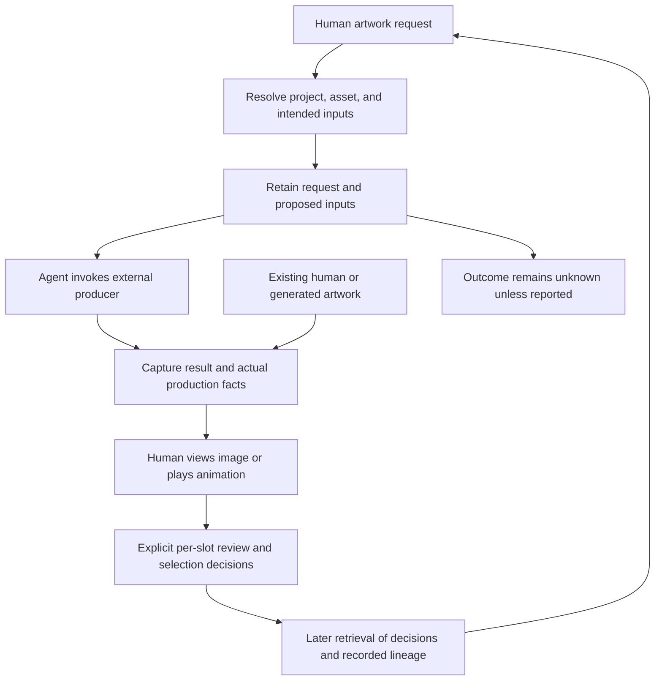
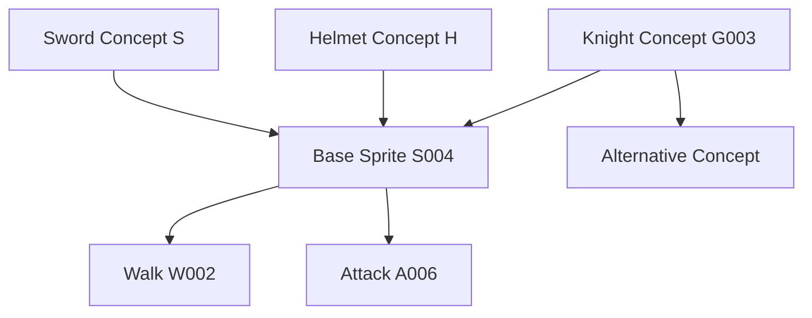
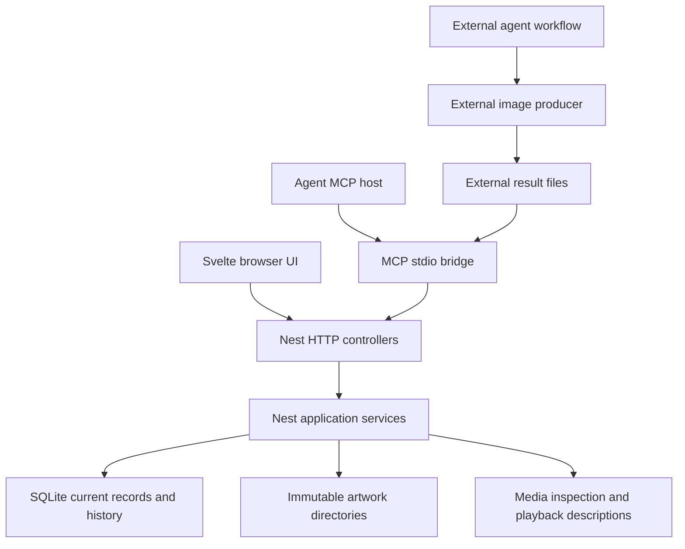
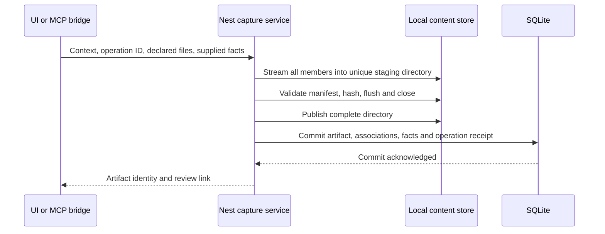
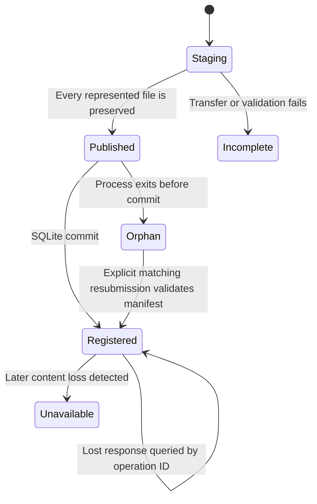
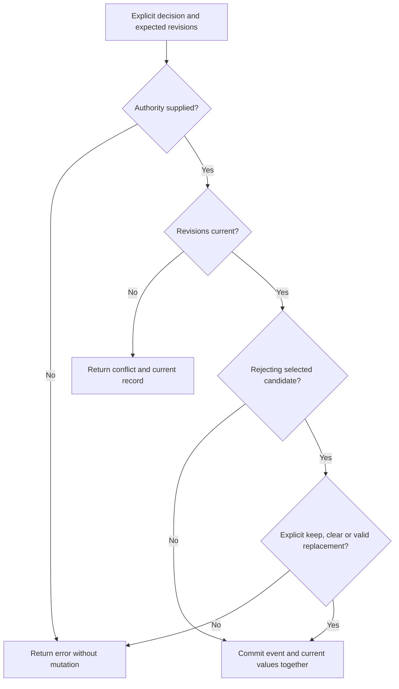

# AssetWeave First Complete Art Workflow - Plan

## Goal Capsule

- **Objective:** A developer and a fresh agent can return to a game-art asset, recover how its artwork came to exist, and continue work without reconstructing history from memory, old chats, or unrelated folders.
- **Product authority:** `STRATEGY.md` remains authoritative and unchanged. This Product Contract defines the first complete workflow within its four tracks.
- **Means:** NestJS/Fastify local service, Svelte browser UI, SQLite records, immutable content, and an MCP stdio bridge (KTD1–KTD4).
- **Execution:** Implement the complete workflow through U1–U11; the implementing agent owns code, documentation, and runtime proof. The developer supplies creative decisions and participates in the founder exercise.
- **Stop conditions:** Do not substitute a mocked producer for AE17, silently change the Product Contract, or report completion without the Verification Contract. Missing external credentials block the producer demonstration, not local implementation.
- **Open blockers:** None for implementation. Authorized OpenAI access and founder participation remain prerequisites for final acceptance.

---

## Product Contract

### Summary

AssetWeave will provide a local artwork workflow for finding artifacts, inspecting their production history, reviewing alternatives, and continuing work through external tools.
The human reviews images and animations and makes creative decisions; AssetWeave exposes recorded information without assessing the artistic state of the work.
Agents retrieve relevant context and handle execution and recordkeeping through the same domain model as the human interface.
The complete workflow will use a NestJS/Fastify backend shared by a Svelte browser interface and MCP, with SQLite metadata and immutable local artwork files.

### Problem Frame

The founder returned to artwork and could not remember how it had reached its current form.
The agent also lacked that context, leaving neither participant able to reconstruct the work reliably.
A file existing somewhere did not answer which inputs produced it, which direction had been chosen, or what had already been tried.

The desired improvement is recoverable evidence, not an automatically assigned assessment of progress.
The developer wants to inspect and filter the available information and judge the work personally.

### Key Decisions

Each entry records why a choice was made; its governed requirements own the behavior.

- **Human interpretation, optional stage label.** Governs R12, R21, R22, R37. The label expresses the developer's own assessment rather than a computed pipeline position. (session-settled: user-directed — chosen over no stage label: retain an optional human declaration without having AssetWeave assess progress.)
- **User-defined selection slots.** Governs R13, R14. Named purposes accommodate concepts, sprites, actions, and directions without fixing a creative taxonomy. (session-settled: user-directed — chosen over artifact-kind or structured-attribute selection scopes: organize choices using the developer's own purposes.)
- **Approval per slot, independent selection.** Governs R16–R19. Acceptability and the current working choice answer different questions. (session-settled: user-directed — chosen over approval-gated selection and artifact-wide approval: preserve working choices and suitability for each use independently.)
- **Explicit choice when rejecting a selection.** Governs R19. A contradictory pair of decisions must be intentional. (session-settled: user-directed — chosen over silent retention or automatic clearing: ask whether to keep, clear, or replace the selection.)
- **Reviewed but undecided is meaningful.** Governs R16. Viewing artwork alone is not a recorded review. (session-settled: user-directed — chosen over one undifferentiated undecided state: distinguish deliberate review from work not yet reviewed.)
- **Agents may relay authorized decisions.** Governs R8, R38. The human remains the decision-maker without being forced into the UI for every action. (session-settled: user-directed — chosen over UI-only decisions: allow an agent to record the specific human instruction.)
- **Task-scoped context with further retrieval.** Governs R5–R7. Recovery starts with relevant facts rather than either an empty index or the complete history. (session-settled: user-directed — chosen over index-only and full-history retrieval: provide enough context to resume while retaining access to the rest.)
- **Clarify ambiguity before production.** Governs R7. A provisional artistic choice is not a substitute for missing human intent. (session-settled: user-directed — chosen over disclosed provisional choices: resolve uncertain project, slot, or source identity before producing artwork.)
- **Retain requests even without outputs.** Governs R9, R10, R34. Interrupted work still has recoverable intent. (session-settled: user-directed — chosen over result-only recording: preserve attempts whose outcome may remain unknown.)
- **Snapshot capture and optional slot placement.** Governs R15, R28, R29. Capture preserves a result without requiring an immediate judgment about its use. (session-settled: user-directed — chosen over live external-file tracking and mandatory slot assignment: retain exact artwork while allowing later organization.)
- **Images and animation playback first.** Governs R24–R27, R46. Native editor support is deferred without defining all future artifacts as image files. (session-settled: user-directed — chosen over native Krita/Aseprite support in the first slice: deliver image review and spritesheet playback first.)
- **Regular grids with local playback descriptions.** Governs R25–R27. Missing animation metadata can be supplied without adding an artwork editor. (session-settled: user-directed — chosen over irregular-atlas playback and externally supplied metadata only: support common sheets and human playback setup locally.)
- **Named clips can be decision targets.** Governs R14, R40. A sheet need not be duplicated to make different decisions about its animations. (session-settled: user-directed — chosen over whole-artifact decisions only: select or approve the specific animation used by a slot.)
- **Input roles are recorded when known.** Governs R32–R34. Starting artwork and a visual reference can have different uses in the same production step. (session-settled: user-directed — chosen over undifferentiated inputs: preserve stated uses without inferring unknown roles.)
- **Older sources are found through lineage and filters.** Governs R22, R36, R37. A changed source selection is not evidence that descendants are unusable. (session-settled: user-directed — chosen over automatic source-difference indicators: expose relationships without assigning attention or validity labels.)
- **All candidates are visible by default.** Governs R20. A creative decision does not silently remove a direction from ordinary browsing. (session-settled: user-directed — chosen over excluding rejected candidates by default: let the developer choose the filtering.)
- **Corrections retain their history.** Governs R39, R40. Correcting a mistake must not erase what was previously recorded. (session-settled: user-directed — chosen over replacement-only metadata: preserve the change, recorder, and time.)
- **Selected clips follow corrections.** Governs R40. A selection continues to identify the named clip while earlier decisions and production inputs keep their historical meaning. (session-settled: user-directed — chosen over keeping the selection pinned until reselection: ordinary playback uses the corrected clip description.)
- **Core filters plus full-text search.** Governs R22, R23. Producer-specific information remains accessible without requiring a general parameter-query system. (session-settled: user-directed — chosen over arbitrary parameter filtering: prioritize the common retrieval workflow.)
- **OpenAI is the first producer exercised.** Governs R45. It supplies a concrete interoperability check, not the domain model. (session-settled: user-directed — chosen over PixelLab and ComfyUI for the first round trip: ground initial coverage in the founder's selected workflow.)

### Actors

- A1. **Developer:** requests artwork, supplies context, reviews results, records creative decisions, and decides what to do next.
- A2. **Agent:** retrieves records, resolves ambiguity with A1, invokes external tools, and records results and explicitly authorized decisions.
- A3. **External producer:** a generator, editor, or human workflow that supplies artwork and whatever production information is available.
- A4. **AssetWeave:** preserves and retrieves local records, displays supported artwork, and exposes the same domain to A1 and A2.

### Requirements

**Agent-driven workflow continuity**

- R1. The product must honor the boundaries and actor responsibilities in `STRATEGY.md`; this contract does not replace or reopen that authority.
- R2. Project organization, capture of available local files, retrieval, review, playback, and human decisions must remain useful locally without a cloud account, hosted service, or available generator.
- R3. Humans and agents must be able to establish, create, find, and annotate projects and logical assets without treating filesystem locations as their identities.
- R4. The local human interface and first-class MCP agent interface must operate on the same artifacts, relationships, requests, and decision records.
- R5. Initial task-scoped context must include project and asset identity, recorded human notes, slots and their selections, target-slot candidates and decisions, and the provenance and inputs of relevant selected or explicitly requested artifacts.
- R6. Context retrieval must expose how to obtain the remaining records, deeper lineage, and downstream dependencies without representing a bounded result as the complete history.
- R7. Ambiguity about the project, destination slot, or intended source artwork must be resolved with the human before new artwork is produced; approval, recency, or prior use must not silently substitute for selection or explicit instructions.
- R8. Agents may record review, selection, and stage decisions only under an explicit human instruction that is retained as the decision's authority.
- R9. When work is known in advance, AssetWeave must retain its request, project and asset context, intended destination when known, proposed inputs, and recording actor and time before external production.
- R10. A known request must retain its captured results and reported outcome, including failure or cancellation when reported; an unreported outcome remains unknown.
- R11. After recording external results, an agent must be able to present those captured candidates and their recorded context for human review without treating capture as a creative decision.

**Asset review and decision clarity**

- R12. A logical asset may have an optional human-set stage label that is visible and filterable, with absence explicit and no assignment or update derived from artifact activity.
- R13. A logical asset must support user-defined named slots representing purposes such as Concept, Base sprite, Walk / north, or Attack / sword.
- R14. A slot candidate may target a whole artifact or a named animation clip within a captured spritesheet, and the same target may participate in multiple slots with independent decisions.
- R15. Capture must allow an artifact to remain unslotted under its project and logical asset until its purpose is established.
- R16. Each candidate's per-slot review state must be unreviewed, reviewed-undecided, approved, or rejected, beginning unreviewed and changing only through an explicit human decision rather than viewing or playback.
- R17. A slot must allow multiple approved candidates simultaneously.
- R18. A slot must allow zero or one current selection independently of approval, including an explicit absence of selection and selection of an unapproved working direction.
- R19. Rejecting a currently selected candidate must require the human to explicitly keep, clear, or replace that selection as part of the decision.
- R20. Ordinary candidate browsing must include all candidates by default, retaining rejected and formerly selected work for later filtering, comparison, and reuse rather than using deletion as creative-state management.
- R21. Review must make the candidate's asset, kind, origin, known and unknown provenance, recorded inputs, alternatives, per-slot decisions, current selection or its absence, downstream relationships, and available human decision actions accessible.
- R22. Core filters must cover project, logical asset, slot or unslotted placement, human stage, artifact kind, review state, selection, producer, dates, and recorded ancestors or descendants, distinguishing capture dates from known production dates.
- R23. Full-text search must cover recorded names, notes, prompts, and other textual metadata, while producer-specific parameters remain inspectable without requiring arbitrary field-level parameter filtering.
- R24. Required first-version media coverage must include PNG images, PNG spritesheets, PNG frame sequences, and GIF images and animations, with frame sequences represented as a single captured creative result rather than unrelated frame records.
- R25. Regular grids and strips must support locally recorded cell geometry, named clips, frame order, and timing supplied by a human or agent with its source retained.
- R26. Humans must be able to view supported images and play their animations, including choosing a named clip, with frame count, duration, and playback rate available when determinable from the recorded or encoded timing.
- R27. A spritesheet without sufficient valid playback information must remain reviewable as a still image with playback explicitly unconfigured, and irregularly packed atlases are still-image-only in this slice.

**Trustworthy lineage and history**

- R28. Capture must preserve the exact contents of an artifact independently of later edits, moves, or deletion of its external original, with an edited result captured as a new artifact rather than replacing prior contents.
- R29. AssetWeave must not report successful capture unless the complete content represented by that artifact has been preserved locally.
- R30. Provenance must retain supplied producer, production time, model or version, prompt, negative prompt, seed, parameters, and human or agent context when available, with capture time kept distinct from production time.
- R31. Provenance must distinguish the source of recorded claims and explicit unknowns from known values or a positively recorded absence, without reconstructing missing facts as certainty.
- R32. Recorded derivation must support one or multiple exact artifact inputs, branching, and inputs from different logical assets without flattening the history into a revision sequence.
- R33. Each input relationship must retain its stated use when known, such as starting artwork or visual reference, and otherwise leave that role unspecified.
- R34. Actual recorded inputs must remain distinct from proposed request inputs and current selections, with no relationship inferred merely from filenames, similarity, ordering, or a planned association.
- R35. Earlier, rejected, and formerly selected artifacts must remain usable as explicit inputs without changing their existing creative decisions.
- R36. Humans and agents must be able to traverse recorded inputs and downstream dependents across multiple steps, stopping at and identifying missing or unavailable history rather than inventing a complete chain.
- R37. Replacing or clearing a selection must not change descendant lineage, approval, or selection, and AssetWeave must not automatically label those descendants stale, affected, invalid, or in need of regeneration.
- R38. Creative decisions must retain their target, recorded human authority, recording actor, time, previous and new values, and any supplied rationale rather than overwriting the earlier decision.
- R39. Corrections to metadata or input relationships must use the corrected information in normal views while retaining the prior record, change, recording actor, and time in history.
- R40. Playback descriptions referenced by recorded clip decisions or inputs must remain recoverable so later corrections do not rewrite the meaning of those historical records. A current selection follows the corrected description of the same named clip; historical decisions and actual production inputs retain the exact playback revision they referenced.

**Generator-independent interoperability**

- R41. Registering artwork must minimally require preservable content and an established project and logical asset, without requiring a known producer, managed request, slot, approval, selection, or complete provenance.
- R42. For work known in advance, an agent must be able to invoke an external producer independently and register its outputs against the retained request with the actual inputs and production information available.
- R43. Existing human-created or externally generated artwork must be registerable afterward through the human or agent interface without inventing a prior managed request or missing production history.
- R44. Integration-specific metadata and capabilities must remain optional, so a producer exposing only artwork can use the same artifact and lineage model as a producer exposing richer generation context.
- R45. The first complete workflow must exercise an actual agent-to-OpenAI-image-generation-to-capture round trip without making OpenAI availability or credentials a condition of using the local application.
- R46. Artifact identity, decisions, and lineage must remain independent of the initial image encodings, allowing later native Krita/Aseprite support to join the same history model without requiring native decoding or editing in this slice.

### Key Flows

- F1. **Request, produce, capture, review.** Covers R3–R11, R16–R19, R28–R34, R41, R42, R45.
  - **Trigger:** The developer requests new artwork for an existing or newly established logical asset.
  - **Steps:** The agent resolves context and any ambiguity, retrieves relevant facts, and records the request. It invokes the external producer independently, then captures results and actual production information. The developer inspects candidates and makes any desired review or selection decisions.
  - **Outcome:** The result is recoverable with its request and recorded inputs even if no candidate is approved or selected.

- F2. **Register artwork after production.** Covers R15, R16, R24, R28–R31, R36, R41, R43.
  - **Trigger:** A human or agent already has artwork produced outside a known AssetWeave request.
  - **Steps:** Establish the project and logical asset, capture the content, attach available facts and explicit input relationships, and optionally assign slots. Leave missing history unknown.
  - **Outcome:** The artwork enters the same review and lineage workflow as an output of F1, without a fabricated session history.

- F3. **Review images and animations.** Covers R14, R16–R27, R38–R40.
  - **Trigger:** The developer finds candidates through browsing, filtering, search, or an agent's presentation.
  - **Steps:** Inspect the image or play the relevant animation, consult supplemental facts and provenance as needed, and compare available candidates. Configure missing regular-grid playback information when known. Record a review decision, selection, or deliberate absence of selection.
  - **Outcome:** The human's decisions are recorded for the particular purpose and target without being inferred from viewing behavior.

- F4. **Derive and revisit branches.** Covers R5–R7, R20–R23, R32–R40.
  - **Trigger:** Further artwork uses one or more earlier artifacts, or a developer returns after time has passed.
  - **Steps:** Find the intended asset and slot, inspect relevant choices and their histories, traverse exact recorded inputs or dependents, and identify unknowns. Resolve any ambiguous next request and continue through F1 using explicitly chosen inputs.
  - **Outcome:** Neither a replaced selection nor a rejected direction removes the evidence needed to resume.

The workflow retains a request even when no result reaches capture, per R9–R10.



The following example illustrates fan-in and branching under R32–R37; each arrow exists only when the relationship was recorded.



### Acceptance Examples

- AE1. **Local use without a generator.** Covers R2–R4, R12, R15, R16, R18, R41, R43.
  - **Given:** No external generator is reachable and no cloud account is configured.
  - **When:** The developer creates a project and Knight asset, captures a local PNG, and later reopens AssetWeave.
  - **Then:** The artifact and records remain available locally. No stage, slot assignment, approval, or selection has been fabricated.

- AE2. **Capture is not a live external-file reference.** Covers R28, R29.
  - **Given:** A PNG has been successfully captured.
  - **When:** Its original external file is edited, renamed, or removed.
  - **Then:** The captured artifact still displays the original content. Capturing the edited output produces another artifact, not a replacement for the first.

- AE3. **Purpose-specific decisions.** Covers R13–R18, R38.
  - **Given:** The same image is a candidate in Concept and Portrait, and a second image is also approved in Concept.
  - **When:** The developer approves the first image for Concept but rejects it for Portrait.
  - **Then:** Both Concept approvals coexist, the Portrait rejection remains separate, and either slot can remain explicitly unselected.

- AE4. **Selection is not approval.** Covers R18, R19, R38.
  - **Given:** An unapproved attack candidate is selected as the working direction.
  - **When:** The developer rejects it for that slot.
  - **Then:** The decision requires an explicit keep, clear, or replace choice. Keep records an intentionally rejected-but-selected candidate; clear leaves no selection; replace uses the candidate explicitly chosen by the human.

- AE5. **Viewing and authorized decisions differ.** Covers R8, R16, R38.
  - **Given:** A newly assigned candidate is unreviewed.
  - **When:** A human or agent opens or plays it without making a decision.
  - **Then:** It remains unreviewed. A later human instruction to mark it reviewed-undecided is recorded as that human's decision, even if an agent performs the recordkeeping.

- AE6. **No computed stage or hidden history.** Covers R12, R20–R23.
  - **Given:** Knight has the human-set stage label Exploring, mixed artifact types, and rejected and formerly selected candidates.
  - **When:** New animations are captured and the asset is browsed.
  - **Then:** The label stays Exploring and all candidates remain in the default set. The developer can filter by recorded facts and search a remembered prompt or note without receiving a system-assigned progress judgment.

- AE7. **Multi-input derivation and reuse.** Covers R31–R36.
  - **Given:** A Knight sprite was produced from a Knight concept, a helmet reference, and a rejected sword direction belonging to another logical asset.
  - **When:** Those exact inputs are registered, with a known role for the helmet and an unknown role for the sword.
  - **Then:** All three inputs are traceable. The sword's role remains unspecified and its rejection remains unchanged. Another output can branch from any of those earlier inputs.

- AE8. **Selection changes do not invalidate descendants.** Covers R20, R22, R36–R38.
  - **Given:** G003 leads to S004, which leads to W002 and A006 through recorded relationships.
  - **When:** G005 replaces G003 in the Concept slot.
  - **Then:** Traversing or filtering descendants of G003 still finds W002 and A006. Their decisions and inputs do not change, G003's prior selection remains in history, and no automatic stale or affected label appears.

- AE9. **Unknown outcomes and actual inputs.** Covers R9, R10, R29, R34, R42.
  - **Given:** A retained request proposes G003 as an input, but the external session ends without reporting a result.
  - **When:** The request is retrieved later.
  - **Then:** Its outcome is unknown, not success or failure. If an output is subsequently captured with G005 recorded as its actual input, its lineage uses G005 while the original proposal remains inspectable.

- AE10. **After-the-fact registration does not manufacture history.** Covers R30, R31, R36, R41, R43, R44.
  - **Given:** The developer imports an image export from a human editing workflow but does not know the original creation time, prompt, or exact source-file version.
  - **When:** The artifact is captured with the available information.
  - **Then:** Capture time is known, unavailable production facts remain unknown, and no managed request or exact source relationship is invented from a filename or external location.

- AE11. **Named clips within one sheet.** Covers R14, R24–R26, R38, R40.
  - **Given:** One captured regular-grid PNG sheet contains four walk frames at eight frames per second and four attack frames at ten frames per second.
  - **When:** The clips are described and played, and the developer selects each for its corresponding slot.
  - **Then:** Walk plays its recorded four-frame sequence with a 0.5-second cycle and Attack plays its own with a 0.4-second cycle. The slots reference their respective clips within the same artifact and may carry different approvals.

- AE12. **Unknown playback data remains unknown.** Covers R25–R27, R31, R39.
  - **Given:** A regular-grid sheet is captured without reliable cell geometry or timing.
  - **When:** It is reviewed.
  - **Then:** The still image is available and animation is explicitly unconfigured. Supplying the missing playback description enables playback and records who supplied it; the product does not invent timing from the pixels.

- AE13. **Animation format boundaries.** Covers R24–R28, R46.
  - **Given:** An animated GIF, a PNG frame sequence with recorded order and timing, and an irregularly packed PNG atlas are captured.
  - **When:** Each is reviewed.
  - **Then:** The GIF uses its encoded animation timing, the frame sequence plays in its recorded order, and the irregular atlas is available as a still image without promised atlas playback. Native Krita/Aseprite decoding is not required.

- AE14. **Corrections preserve what was recorded.** Covers R38–R40.
  - **Given:** An input link or a clip's playback description was recorded incorrectly.
  - **When:** A human or agent corrects that information.
  - **Then:** Normal views use the corrected value, while history identifies the previous entry and its correction. A current selection follows the corrected named clip, while earlier decisions and actual production inputs retain their referenced playback revisions.

- AE15. **A fresh agent can resume without memory.** Covers R5–R8, R21–R23, R30–R38.
  - **Given:** Knight has selected artwork, approved alternatives, attack candidates, older source branches, and some missing provenance.
  - **When:** A fresh agent receives “Make another attack animation for Knight.”
  - **Then:** It can retrieve the task-scoped facts and obtain deeper history as needed without old chats. If the project, attack slot, or intended inputs remain ambiguous, it asks before production rather than choosing the newest or approved candidate by default.

- AE16. **An unselected slot is a legitimate state.** Covers R7, R18, R34.
  - **Given:** The Attack slot has no selection, but the human explicitly identifies the project, destination slot, and intended source artifact for new work.
  - **When:** The agent prepares that work.
  - **Then:** It may proceed under the explicit instruction without first selecting a candidate or treating the absence of selection as an error.

- AE17. **Real producer interoperability.** Covers R9–R11, R28–R31, R41, R42, R44, R45.
  - **Given:** An agent has access to an actual OpenAI image-generation tool independently of AssetWeave.
  - **When:** It records a request, invokes that tool, and captures the returned image with available production context.
  - **Then:** The developer can retrieve and review the preserved image and its records. Unexposed settings remain unknown, and neither approval nor selection is granted automatically. Local use continues when the external tool is later unavailable.

- AE18. **Incomplete content is not successful capture.** Covers R9, R10, R28, R29, R41.
  - **Given:** A producer reports an output location, but the image cannot be obtained, or a multi-frame result is missing some of the content it claims to contain.
  - **When:** Registration is attempted.
  - **Then:** AssetWeave does not report that artifact as successfully captured. An existing request remains recoverable with the reported problem or unknown outcome instead of a fabricated complete artifact.

### Success Criteria

Evaluation uses local project records and manual founder-workflow exercises, following `STRATEGY.md` under Key metrics.
The acceptance examples are the required behavior checks; the measures below assess whether the complete workflow solves the revisit problem.

| Measure | Exercise | Required evidence |
| --- | --- | --- |
| Asset-state clarity | Sample logical assets and their slots after mixed capture and decision activity. | The developer correctly identifies the human stage label or its absence, approved alternatives, and each slot's selection or explicit absence. Record the proportion correct against the local records. |
| Decision-ready retrieval time | Time a return to a known asset and intended result using only AssetWeave. | Record elapsed time until the developer has enough context to make the next iteration decision, without old chats or unrelated folders. Establish a baseline rather than impose an invented numeric threshold. |
| History reconstruction success | Sample results containing branches, multiple inputs, and missing provenance. | The developer and a fresh agent trace the exact recorded inputs, known production steps, and decisions. Record the proportion reconstructed correctly; correctly identifying missing history counts as truthfulness, not recovered history. |
| Workflow continuity | Complete F1 and F2, then revisit through F4 after restarting and discarding conversational context. | Captured content, decisions, requests, and lineage remain sufficient to continue from recorded facts under R5–R11 and R28–R40. |
| Local independence | Repeat local retrieval and review without an available generator or hosted account. | The local behaviors in R2 remain usable; the optional external producer is needed only for its own production step. |

All conditional outcomes in AE1–AE18 must hold.
The successful first demonstration includes real externally generated artwork, an after-the-fact human image import, playable spritesheet clips, alternative decisions, a multi-input branch, a changed selection with older descendants, and an explicit unknown in the recovered history.

### Scope Boundaries

**Deferred for later**

- Native Krita/Aseprite decoding and review; supported image exports use R43 in the meantime, and future continuity is governed by R46.
- Irregular-atlas animation playback, specialized animation-analysis tools, and broader producer coverage beyond R24–R27 and R45.
- Arbitrary producer-parameter filtering beyond R22–R23.
- Godot synchronization, engine import, publishing, and in-game verification, as excluded from this slice by the art-workflow boundary in `STRATEGY.md`.

**Outside this product's identity**

- Artwork generation and artwork editing inside AssetWeave.
- Generic project management, team scheduling, studio collaboration infrastructure, enterprise DAM or permissions, and source-control replacement.
- Required cloud sync, hosted services, a generator marketplace, or an integration catalog pursued for breadth.

**Not implied by this contract**

- A job runner, scheduling system, retry orchestration, or ownership of external generator sessions; R9–R10 concern records of work, not execution management.
- Automatic reconstruction of unrecorded past conversations or production history; R31 and R36 govern gaps.
- Automatic artistic assessments, regeneration demands, or publication status; R12, R18, and R37 govern the relevant distinctions.
- A prescribed screen layout, database schema, endpoint or MCP tool vocabulary, storage hierarchy, ORM, or frontend component architecture.

### Dependencies and Assumptions

- The real producer demonstration in AE17 requires an agent with authorized access to OpenAI image generation. No claim is made that every tool or model exposes seeds, negative prompts, or reproducible settings; R30–R31 and R44 govern absent capabilities.
- Playback requires sufficient encoded or supplied timing and frame information. R25–R27 permit human-supplied descriptions without claiming those descriptions originated with the producer.
- Historical reconstruction is bounded by what was recorded or can be supplied truthfully. An old image can be preserved even when its production history cannot be recovered.
- Required first-version media coverage is specified by R24. Native source documents are not necessary for the first complete workflow.
- Founder exercises establish retrieval-time measurements before a numerical performance target is adopted.

### Outstanding Questions

**Resolve Before Planning:** None.

**Resolved in the Planning Contract:** Application startup, backend/frontend composition, persistence, content storage, search, MCP operations, and playback rendering.
NestJS is a required backend choice; KTD1 records the user direction.
The remaining technical choices implement R1–R46 without replacing their authority.

### Sources

- `STRATEGY.md`, especially Boundaries, Key metrics, and Tracks: authoritative product constraints and evaluation framework.
- Founder workflow evidence: both the developer and the agent failed to remember how an existing artwork result had reached its current form.

---

## Planning Contract

**Product Contract preservation:** Clarified R40 and AE14 with the user-confirmed selected-clip correction behavior; added its Key Decision. R1–R39, R41–R46, the other acceptance examples, and the original scope boundaries are unchanged. Summary and planning-question text now reflect the chosen implementation.

### Repository Baseline

Only `STRATEGY.md` and this plan exist in the workspace.
There is no application, manifest, test suite, migration history, Git repository, `CONCEPTS.md`, or institutional-learning corpus to extend.
Every implementation path below is a proposed addition, not an existing pattern.
Git setup is separate from application correctness; do not create a remote, publish artwork, or change the user's global Git identity as part of this work.

### Key Technical Decisions

- KTD1. **NestJS owns application behavior.** Use TypeScript and pnpm workspaces with `apps/server`, `apps/web`, `apps/mcp`, and `packages/contracts`. Nest modules contain injectable application services, thin controllers, and explicit SQLite repositories; neither Svelte nor MCP implements domain rules. Use NestJS with `FastifyAdapter`, not an Express backend or a plain Fastify application. Supports R3–R4. (session-settled: user-directed — chosen over plain Fastify: retain the requested NestJS backend.)

- KTD2. **One local service, independently started.** The built Nest process serves the static Svelte application, JSON API, and authenticated media on one loopback origin. The MCP host starts only the stdio bridge, which connects to that service. Closing a browser or bridge does not stop Nest; an unavailable service produces an actionable error, never a second database owner or an empty catalog. Use a configurable app-owned data directory outside the source tree, defaulting to the current user's local application-data directory. Hold an exclusive ownership lock for its canonical path before migrations; refuse another live owner. A stale lock may be reclaimed only after the recorded process is confirmed absent. Keep startup and shutdown explicit; no autostart installer or service manager. Supports R2, R4. (session-settled: user-approved — chosen over a desktop installer and independently writing MCP processes: launch from the project and keep one persistence owner.)

- KTD3. **SQLite current records with retained revisions, not full event sourcing.** Use parameterized SQL through Node's built-in SQLite binding, versioned SQL migrations, foreign keys, WAL, and FULL synchronous commits. The initial migration defines the complete relational identity/constraint model, including artifacts, requests, playback revisions, candidates, and decision history, before their services are implemented. One Nest-owned connection performs short transactions; streaming and media decoding occur outside them.

  Each mutation appends history, updates current records, and advances one database-wide mutation watermark atomically.
  Once U7 introduces search, its projections join the same transaction.
  History stores actor, time, target, prior/new values, and supplied authority/rationale as applicable.
  Expected-version checks prevent last-writer-wins between UI and MCP.
  No ORM or event-replay framework is needed.
  Supports R9–R10, R31, R38–R40.

- KTD4. **Publish complete content before committing its artifact record.** Store each capture in its own immutable, server-named directory with an ordered manifest, byte counts, and SHA-256 hashes. Stream into a sibling staging directory, finish and flush files, close handles, publish by same-volume rename to a fresh destination, then commit artifact metadata and associations. Success is returned only after the database commit. A client capture-operation ID permits retrieval or explicit resubmission of the same capture after a lost response; reusing it with different content or context is a conflict. Equal bytes from distinct captures remain distinct artifacts. No hard links to external originals, automatic deduplication, overwrite, or remote-URL fetching. Supports R24, R28–R29, R41–R44. (session-settled: user-approved — chosen over storing artwork bytes in SQLite: keep metadata and immutable artwork files separate, with explicit crash reconciliation.)

  Capture identity is protected by an atomic in-flight claim and a unique committed operation receipt.
  Before publication, flush a canonical recovery descriptor containing the operation ID, original context, facts, actual inputs, placement, and complete member manifest.
  Explicit orphan resubmission must match that descriptor and revalidate references/cycles in the registration transaction.
  Concurrent matching submissions resolve to one receipt; different completed fingerprints conflict.
  Bytes not received before an interruption have no known fingerprint and must not be claimed as compared or preserved.

- KTD5. **Facts carry assertion state and source.** A supplied provenance fact is known-with-value, explicitly unknown, or positively absent; an omitted fact has no assertion and is displayed as not recorded. Record claim source separately from the recording actor. Preserve nested producer metadata without requiring provider-specific columns; index its textual leaves for search. System-observed capture time never substitutes for production time. Corrections create revisions of claims and actual-input relationships while current queries use the effective revision. The database does not infer truth from the recorder's identity. Supports R30–R34, R39, R44.

- KTD6. **Separate requests, actual derivation, and creative decisions.** Requests contain immutable intent/proposed-input snapshots and separately reported outcomes. Capture may reference a request but does not imply that the external request succeeded. Actual-input edges reference exact artifact IDs and, for clip inputs, playback revision IDs; input role remains nullable when unspecified. Reject self-links and cycles in the effective derivation graph, but do not require chronological capture order. Unknown or unavailable upstream history is a gap assertion, not a fabricated artifact or edge. Supports R9–R10, R32–R37, R42–R43.

- KTD7. **Stable clip identity, immutable playback revisions.** A named clip belongs to one immutable artifact and has an ordered sequence of playback-description revisions. Candidate identity is `(slot, artifact)` or `(slot, clip)`, independent of encoding and display name. Current views resolve the clip's current revision; decision events record the revision seen at decision time, and actual-input edges pin the production revision. A correction changes neither candidate review state nor selected candidate identity. New human decisions use the current revision and retain it in their events. Supports R14, R25, R38–R40, R46. (session-settled: user-directed — chosen over pinning current selection until reselection: implement the R40 distinction between current selected playback and historical referents.)

  Clip-targeted decisions submit the playback revision actually observed; the transaction checks it against the current revision and returns a conflict if correction intervened.
  Actual playback-specific production inputs must supply the exact used revision, never default to the current one at capture time.
  If that revision is unknown, record the known artifact relationship and an explicit playback-history gap rather than invent an exact clip input.

- KTD8. **Creative mutations are explicit, atomic commands.** Keep candidate review state separate from the slot's nullable selected-candidate ID. Selection must reference a candidate in that slot. Rejecting its selected candidate requires keep, clear, or a replacement candidate in the same transaction, with the relevant expected slot/candidate revisions. Agent-recorded stage, selection, and review commands require retained human instruction text or an immutable local copy of its referenced content. Direct UI actions record the deliberate action as authority. Label agent-relayed authority as reported, not verified human identity. Missing authority, a stale revision, or an invalid replacement changes nothing. Supports R8, R12, R16–R19, R38.

- KTD9. **Queryable records and bounded, expandable context.** Use indexed relational filters, recursive lineage queries, and SQLite FTS5 over a transactional text projection. Browse all candidates unless a filter is explicitly supplied. Search current facts by default and expose historical-text matches through an explicit history option; each historical hit identifies its revision. Keyset cursors carry query identity and a database revision watermark. If the watermark changes, require a fresh query rather than silently mix snapshots. Task context returns the R5 categories, each with explicit omitted counts or `has_more` and continuation operations. Long notes, provenance, and candidate collections have visible truncation boundaries and full-record retrieval. No opaque artistic ranking, recommended source, or inferred selection. Supports R5–R7, R20–R23, R36.

  U7 atomically backfills both current and revision-addressable historical text from existing records before enabling search.
  It installs projection maintenance for every mutation path; migration failure rolls back both index changes and schema version.

- KTD10. **Thin MCP adapter with explicit tool discovery.** Use the supported MCP TypeScript SDK's stdio server with structured tool inputs/results. Ordinary tools cover catalog operations, requests/outcomes, capture, corrections, playback descriptions, decisions, search/context, lineage, and history. Artifact resources use opaque IDs; a media-reading tool also exposes supported captured images so access does not depend on a host automatically loading resources. Preserve complete original-file access separately from bounded image previews. The bridge reads explicitly supplied local paths and streams bytes to the authenticated capture API; HTTP accepts bytes, never arbitrary server-local paths. Logs go to stderr only. Supports R4–R11, R41–R45.

  Returned notes, prompts, filenames, and tool-supplied metadata are labeled recorded evidence, not executable instructions or human authority.
  The bridge never extracts a file-read request from that text automatically.

- KTD11. **Browser playback, preserved originals, sourced timing.** Display original PNG/GIF files; use the browser's GIF decoder rather than a second GIF compositor. Sharp performs bounded image inspection and supported-media validation without replacing originals. A small bounded GIF control-block reader distinguishes encoded delays from absent controls; Sharp's defaulted delay is not an encoded fact. Report encoded duration separately from viewer timing/clamping, and do not invent one FPS for variable-duration frames. Regular-grid clips and explicit PNG sequences use a canvas scheduler based on cumulative recorded durations. Grid descriptions include cell size, origin, spacing, frame indices/order, and timing; reject out-of-bounds geometry and nonpositive supplied durations. Without sufficient valid data, expose unconfigured playback and a still view. Supports R24–R27, R31, R40, R46.

  Capture completeness and preview eligibility are separate results.
  A complete preserved byte manifest may be registered even when opaque or undecodable, per R41; it receives an explicit unavailable preview rather than a false supported-media claim.
  Missing represented members remain a capture failure under R29.
  Only media verified for inline display receives an image response; other originals remain downloadable without script execution.

- KTD12. **Protect the local service and its private profile.** Bind to `127.0.0.1`; enforce exact Host, Origin, and request-credential checks in a Fastify early request hook before body parsing, uploads, static fallback, or media access. Disable proxy trust and broad CORS. Browser APIs/media require an HttpOnly SameSite=Strict session; mutations also require same-origin requests and a CSRF header. Missing or foreign Origin cannot bootstrap a browser session.

  Browser pairing requires a short-lived, single-use, profile-bound capability from the private local launcher.
  The launcher displays it only on explicit interactive request; the human pastes it into the local pairing form for exchange by same-origin POST.
  It never appears in URLs, static assets, application logs, or MCP output.
  Rotate session keys and the separate MCP bearer on each service start.
  Bridge discovery is bound to its selected canonical profile.

  Verify current-user Windows ACLs on the entire profile, including SQLite/WAL, artwork, staging, ownership locks, and discovery files, before migrations.
  Refuse insecure or substituted reparse-point paths rather than claiming `chmod` supplies Windows privacy.
  Render recorded text as text, not HTML.
  Use verified fixed image MIME types, `nosniff`, restrictive same-origin CSP, and download disposition for nonpreview originals.
  Never expose the content directory as a static root or interpolate uploaded names into paths.
  Same-user malware, administrators, and compromised MCP hosts remain outside this boundary.

### Dependency Baseline

Pin the compatible versions below and commit the resulting lockfile during implementation.
These are documentation/registry findings, not an installation or runtime result.

| Component | Selected baseline | Reason or compatibility constraint |
| --- | --- | --- |
| Node.js | 24.21.0 LTS | Bundles SQLite 3.53.4 with FTS5; `node:sqlite` remains release-candidate, so isolate its use behind repositories. |
| NestJS core/common/platform-fastify | 11.2.6 together | Required framework; this adapter uses Fastify 5.11.3. |
| Fastify static plugin | 10.1.5 | Matches this Nest adapter's `^10.1.2` peer; do not mix the older static 8.x pairing from earlier Nest patches. |
| Svelte / Vite / Svelte Vite plugin | 5.57.1 / 8.3.1 / 7.3.1 | Compatible documented peers and Node engines; use the Svelte TypeScript SPA template, not SSR. |
| MCP server SDK / shared validation | `@modelcontextprotocol/server` 2.2.0 / Zod 4 | SDK v2 is stable; share schemas and response types, not backend storage code. |
| Sharp | 0.35.5 | Maintained PNG/GIF decoder with Windows x64 prebuilt dependencies; this is still a native installation dependency. |
| Tests / package manager | Node test runner / pnpm | Use real temporary stores for domain integration tests; pin pnpm and TypeScript versions when creating the workspace. |

The service must verify its actual SQLite version, FTS5 support, WAL mode, and foreign-key enforcement at startup.
Do not enable SQLite extension loading.
The documented WAL-reset defect is fixed in SQLite 3.51.3 and later; reject an older unpatched build rather than trust the Node version string.
Use Fastify-compatible upload/static plugins and Nest adapter APIs, not Express/Multer recipes.
No OpenAI SDK or credentials belong in the Nest dependency graph.

### High-Level Technical Design

**Component ownership**



**Capture protocol**



**Capture lifecycle and interruption boundary**



Incomplete staging and orphans are technical recovery records, not captured candidates or creative states.
Startup reconciliation reports them without silently creating artworks or deleting their contents.
Registered metadata/history survives detection of unavailable content, which is distinct from unknown production history.
Do not promise hardware power-loss atomicity across the content directory and SQLite: Node's Windows rename does not flush the parent directory as part of the database commit.

**Creative-command branching**



**Record shape**

| Record family | Current identity and relation | Retained evidence |
| --- | --- | --- |
| Project / logical asset / slot | Opaque stable IDs; asset belongs to project, slot to asset | Names, notes, stage and correction/decision history |
| Artifact / content member | Artifact belongs to asset; immutable manifest names all content members | Capture operation, hashes, source names and capture time |
| Request / proposed input / outcome | Request belongs to project/asset; destination is optional | Original intent and exact proposed targets; separately reported outcomes |
| Provenance assertion / input edge | Effective facts and exact artifact or clip-revision inputs | Source, unknown/absent distinction, superseded revisions and gap assertions |
| Clip / playback revision | Stable clip ID on artifact; current revision pointer | Every referenced geometry/order/timing revision and its source |
| Candidate / slot selection | Candidate targets artifact or clip; selection belongs to slot | Per-slot review history, selected target revision at each decision |
| Audit event / authority | One mutation's actor, target and timestamp | Before/after values, instruction and supplied rationale |

**Shared operation surface**

| Domain action | Human interface | MCP operation family | Commit boundary |
| --- | --- | --- | --- |
| Establish/create/find/annotate | Project and asset browser, forms | Catalog list/get/create/update | Current record plus revision history |
| Define slots/place candidates | Asset slots, unslotted browser | Slot and candidate commands | Placement only; no creative decision |
| Retain request/report outcome | Asset request/history panel | Request record/get/outcome | Intent snapshot or explicit outcome report |
| Capture existing/new outputs | File picker or drop, ordered sequence manifest | Capture local files with explicit context | KTD4 |
| Correct facts or derivation | Inspector correction forms | Provenance/input correction | KTD3, KTD5–KTD6 |
| Describe/play media | Still viewer, clip editor, playback controls | Describe/get playback; read media | Description revision; reads are mutation-free |
| Review/select/set stage | Deliberate decision controls | Authority-bearing decision tools | KTD8 |
| Find/recover context | Filters/search, lineage and history panels | Search/context/lineage/history tools | Consistent read snapshot with continuation |

No operation called “generate artwork” exists in this surface.
MCP tool descriptions explain R7 and require explicit identifiers for production inputs; a tool cannot prevent an unrelated external producer from being invoked outside the workflow.
The fresh-agent exercise must therefore verify agent behavior as well as API validation.

### Query and Interface Details

- Slot names are user-provided and unique within an asset after a documented normalization rule; asset names need not be globally unique. Name-based searches return disambiguating IDs and project context.
- Explicit candidate placement may target artwork from another logical asset without changing artifact ownership or creating a derivation edge. Show both the slot's context and the target's original asset/project; decisions remain slot-scoped under R14.
- Current filters compose with AND across categories and OR within a category. Review and selection filters operate on candidate placement, not artifact-wide approval.
- Unslotted means an artifact has no whole-artifact or clip candidate placement. Browsing its other slots must not hide it from an explicitly selected slot's candidate list.
- Capture-date and production-date filters are separate. Unknown production dates do not become capture dates and are excluded from a known-date range unless the unknown option is explicitly included.
- Multi-hop lineage reports direction, visited targets, continuation frontier, and encountered gaps. A bounded page is never labeled the full graph.
- UI navigation uses stable-ID deep links for projects, assets, candidates, artifacts, requests, and historical revisions. Tabs expose current facts, recorded inputs/dependents, and history without replacing the main image.
- Ordinary browse and side-by-side comparison retain rejected and formerly selected candidates. Controls distinguish approval, review, selection, and human stage without computing a pipeline position.
- Surface conflicts with the current record and the uncommitted user input; require a new explicit action rather than silently replaying a creative decision.
- The data directory must be on a local filesystem, not a network share or live synchronized folder. Document a stopped-service directory copy as the initial backup procedure; do not copy only an active SQLite main file.

### Sequencing and Alternatives

Establish the runtime boundary and catalog first, then request/lineage records and immutable capture.
Media identities precede creative decisions; search/context consumes those records.
UI and MCP integrate against the same completed application services.
The final proof crosses all these boundaries and is not replaced by individual unit results.

Direct SQLite access from every MCP subprocess was rejected because it would spread migration ownership and content publication across processes.
A desktop wrapper adds packaging obligations without improving the required history semantics.
Database BLOBs would simplify one durability boundary but bind large-file transfer to database writes; the confirmed file-store design retains explicit reconciliation instead.
Full event sourcing would add replay/versioning machinery when current relational records plus immutable revisions satisfy R38–R40.
These choices were resolved from the stated workflow and published constraints; no remaining mechanism required a prototype or competing implementation to choose.

### Risks and Execution-Time Checks

| Risk | Mitigation and required evidence |
| --- | --- |
| Content publication and SQLite are not one durable transaction | KTD4 ordering, interruption tests, restart reconciliation, and explicit unavailable-content reporting; do not claim recovery of physically lost bytes. |
| Browser requests reach a privileged local process | KTD12 plus actual hostile-origin and unauthenticated-media checks, not only guard unit tests. |
| Native Sharp package or SDK host incompatibility | Verify installation on Windows and actual MCP host initialization early; retain exact installed versions in evidence. |
| Large sheets/sequences exhaust memory or stall requests | Stream originals, bound upload bytes/frame counts/pixel work, inspect outside transactions, and lazily load visible frames. Document shipped limits and exercise their boundaries without changing the required media categories. |
| GIF decoder defaults become false provenance | Preserve bytes and distinguish encoded control data from decoder/viewer behavior under KTD11. |
| Synchronous SQLite queries delay media/API responses | Indexed filters, bounded reads, and short transactions; measure founder-sized data before introducing workers or caching. |
| Human authority is overclaimed | Retain the instruction and recorder under KTD8; state the trusted-local-client boundary rather than claiming authenticated human intent. |
| External generation changes or credentials are absent | Exercise a currently supported authorized OpenAI tool outside AssetWeave; record actual exposed settings only. Do not replace the live acceptance exercise with a mock. |

Exact helper names, component styling, operational limits, and installation-specific host configuration remain implementation details.
They do not reopen the selected stack or Product Contract.
No runtime compatibility, browser behavior, or OpenAI access was tested during planning.

### Sources and Research

- [Nest Fastify adapter](https://docs.nestjs.com/techniques/performance) and [Nest static assets](https://docs.nestjs.com/techniques/mvc): KTD1 and adapter-specific plugin/static routing.
- [Node 24 SQLite API](https://nodejs.org/docs/latest-v24.x/api/sqlite.html), [pinned SQLite header](https://github.com/nodejs/node/blob/v24.21.0/deps/sqlite/sqlite3.h), and [build flags](https://github.com/nodejs/node/blob/v24.21.0/deps/sqlite/sqlite.gyp): KTD3 and the runtime capability gate.
- [SQLite transactions](https://www.sqlite.org/lang_transaction.html), [WAL](https://sqlite.org/wal.html), and [FTS5](https://www.sqlite.org/fts5.html): KTD3/KTD9, durable commits, transactional index maintenance, and local-filesystem restrictions.
- [Node filesystem API](https://nodejs.org/docs/latest-v24.x/api/fs.html) and [Node's bundled Windows filesystem implementation](https://raw.githubusercontent.com/nodejs/node/v24.21.0/deps/uv/src/win/fs.c): KTD4's publication limits and KTD12's Windows permission caveat.
- [MCP stdio](https://modelcontextprotocol.io/specification/2026-07-28/basic/transports/stdio), [SDK v2 tools](https://ts.sdk.modelcontextprotocol.io/v2/servers/tools.md), and [resources](https://ts.sdk.modelcontextprotocol.io/v2/servers/resources.md): KTD10, structured results, transport purity, and host-dependent resource access.
- [Vite](https://vite.dev/guide/), [Svelte Vite plugin](https://github.com/sveltejs/vite-plugin-svelte), and [Vite development-server security](https://vite.dev/config/server-options): local SPA composition and development-origin constraints.
- [Sharp installation](https://sharp.pixelplumbing.com/install/), [metadata](https://sharp.pixelplumbing.com/api-input/), and [constructor limits](https://sharp.pixelplumbing.com/api-constructor/): KTD11, native packaging, full validation versus header inspection, and decode bounds.
- [GIF89a specification](https://www.w3.org/Graphics/GIF/spec-gif89a.txt): encoded frame timing and control-block presence under KTD11.
- [OWASP CSRF prevention](https://cheatsheetseries.owasp.org/cheatsheets/Cross-Site_Request_Forgery_Prevention_Cheat_Sheet.html): KTD12.
- [OpenAI image generation](https://developers.openai.com/api/docs/guides/image-generation) and [deprecations](https://developers.openai.com/api/docs/deprecations): AE17 must use a live supported producer; provider/model names are recorded data, not schema enums.

---

## Output Structure

All paths in this tree are proposed.

```text
apps/
  server/
    src/
      runtime/
      database/migrations/
      catalog/
      requests/
      provenance/
      lineage/
      capture/
      media/
      decisions/
      queries/
    test/
  web/
    src/
      lib/api/
      lib/components/
      features/catalog/
      features/capture/
      features/review/
  mcp/
    src/
    test/
packages/
  contracts/
    src/
    test/
tests/
  fixtures/media/
  integration/
docs/
  verification/
```

---

## Implementation Units

| U-ID | Change | Primary paths | Depends on |
| --- | --- | --- | --- |
| U1 | Runnable Nest workspace and local boundary | `apps/server/src/runtime/`, root manifests | None |
| U2 | Catalog, persistence, and revision records | `apps/server/src/catalog/`, `apps/server/src/database/` | U1 |
| U3 | Requests, claims, and exact input history | `apps/server/src/requests/`, `apps/server/src/provenance/`, `apps/server/src/lineage/` | U2 |
| U4 | Immutable complete capture | `apps/server/src/capture/` | U2, U3 |
| U5 | Media and versioned playback descriptions | `apps/server/src/media/` | U4 |
| U6 | Human-authorized creative decisions | `apps/server/src/decisions/` | U2, U5 |
| U7 | Filters, search, lineage, and task context | `apps/server/src/queries/` | U3–U6 |
| U8 | MCP parity and local-file streaming | `apps/mcp/src/` | U1, U7 |
| U9 | Browser organization and capture | `apps/web/src/features/catalog/`, `apps/web/src/features/capture/` | U4, U7 |
| U10 | Browser review, playback, and correction | `apps/web/src/features/review/` | U5–U7, U9 |
| U11 | Complete founder workflow proof and operating docs | `tests/integration/`, `docs/verification/` | U8, U10 |

### U1. Runnable Nest workspace and local boundary

**Goal:** Start an independently useful local Nest service and serve the browser shell through the intended security boundary.
**Requirements:** R1–R4; A1, A2, A4.
**Dependencies:** None.
**Files:** `package.json`, `pnpm-workspace.yaml`, `pnpm-lock.yaml`, `.node-version`, `tsconfig.base.json`, `.gitignore`, `apps/server/package.json`, `apps/server/src/main.ts`, `apps/server/src/app.module.ts`, `apps/server/src/runtime/runtime.module.ts`, `apps/server/src/runtime/local-access.plugin.ts`, `apps/server/src/runtime/profile.service.ts`, `apps/server/test/runtime.test.ts`, `apps/web/package.json`, `apps/web/vite.config.ts`, `apps/web/src/App.svelte`, `packages/contracts/package.json`, `packages/contracts/src/errors.ts`.
**Approach:**
1. Establish the KTD1 dependency graph and baseline versions, with Nest compilation preserving decorator metadata.
2. Implement profile ownership, loopback binding, credential discovery, browser sessions, and clean shutdown under KTD2/KTD12.
3. Serve built static assets with an explicit UI fallback that cannot mask API/media failures; expose no placeholder domain endpoints.
**Patterns to follow:** Nest's documented Fastify adapter/plugin APIs; no existing repository code.
**Test scenarios:**
1. Starting a second service for the same profile refuses to write; a different profile cannot reuse its credentials.
2. Wrong Host, foreign/null Origin, missing CSRF, absent bearer, and pre-restart bearer cannot mutate or read private records/media.
3. Valid same-origin session and bridge credentials reach the same service; closing a browser does not stop it.
4. API/media not-found remains an error rather than returning the SPA document.
5. Forged same-origin headers without a pairing capability cannot obtain a session; used, expired, wrong-profile, and pre-restart capabilities/cookies fail.
6. Hostile-origin multipart requests are rejected before any staging file is created; an insecure custom profile fails startup before migrations.
**Execution note:** Prove the actual listener, Windows private-file permissions, and production static build before adding domain features.
**Verification:** A real browser opens the built shell; explicit start/stop and host rejection work on Windows, with secrets absent from logs.

### U2. Catalog, persistence, and revision records

**Goal:** Persist project/asset/slot identities and annotations with a reusable transactional history mechanism.
**Requirements:** R2–R4, R12–R15, R38–R39; F2, AE1.
**Dependencies:** U1.
**Files:** `apps/server/src/database/database.module.ts`, `apps/server/src/database/database.service.ts`, `apps/server/src/database/migrations/001-domain.sql`, `apps/server/test/helpers/store-fixture.ts`, `apps/server/src/catalog/catalog.module.ts`, `apps/server/src/catalog/catalog.service.ts`, `apps/server/src/catalog/catalog.controller.ts`, `apps/server/src/catalog/catalog.repository.ts`, `packages/contracts/src/catalog.ts`, `apps/server/test/catalog.test.ts`, `apps/server/test/database.test.ts`.
**Approach:** Establish KTD3's complete constrained schema and global mutation watermark in `001-domain.sql`; later units add services over it, not references to tables that do not yet exist. Provide real temporary-store fixtures with valid immutable bytes and revision records for isolated service tests. Implement catalog names/notes/slots while leaving creative mutation services to U6. No destructive artwork deletion operation is needed.
**Patterns to follow:** KTD1 service/controller/repository boundary; SQLite transaction and foreign-key documentation.
**Test scenarios:**
1. Covers AE1. Create a project and asset, close/reopen the store, and retrieve the same IDs and notes with no invented stage or slots.
2. Same-named assets in separate projects remain distinguishable; duplicate normalized slot names within an asset are rejected.
3. Annotation correction exposes the new value and retained old value; stale expected revision leaves both current state and history unchanged.
4. A failed migration rolls back its version/changes; a database from an unsupported newer schema is refused without mutation.
5. Candidate targets, selection ownership, artifact inputs, and clip-revision references reject dangling or incompatible IDs with foreign keys enabled.
**Verification:** Actual HTTP creation and retrieval survive service restart; failed mutations do not leave partial history.

### U3. Requests, claims, and exact input history

**Goal:** Record intent before production and preserve supplied provenance and actual derivation independently.
**Requirements:** R9–R10, R30–R39, R41–R44; F1, F2, F4.
**Dependencies:** U2.
**Files:** `apps/server/src/requests/requests.module.ts`, `apps/server/src/requests/requests.service.ts`, `apps/server/src/requests/requests.controller.ts`, `apps/server/src/provenance/provenance.service.ts`, `apps/server/src/lineage/lineage.service.ts`, `packages/contracts/src/production.ts`, `apps/server/test/production.test.ts`, `apps/server/test/lineage.test.ts`.
**Approach:** Implement KTD5–KTD6 services over the U2 schema. Keep request outcome reporting separate from capture and expose a request receipt before external work. U3 tests use valid stored-record fixtures; U4 supplies real capture-driven integration, U5 creates clip revisions, and U6 exercises decision-preserving reuse. Foreign-key checks apply from the first migration, not as a later repair.
**Patterns to follow:** U2's transaction/revision mechanism; no provider-specific request subclasses.
**Test scenarios:**
1. Covers AE9. Proposed G003 and later actual G005 remain distinct; a request with no reported outcome remains unknown after restart.
2. Covers AE10. Omitted prompt, explicitly unknown seed, and positively absent negative prompt remain distinguishable from supplied values.
3. Covers AE7. Three inputs across logical assets retain independent roles; reusing a rejected source does not change its decisions.
4. Correcting an input updates effective traversal but preserves the previous edge and actor/time; self-links and cycles fail without changing the graph.
5. A reported failure/cancellation remains visible even when an output is later captured; capture does not overwrite the report.
**Verification:** Retrieve the request and corrected multi-input history through real service calls, including an explicit gap in source history.

### U4. Immutable complete capture

**Goal:** Capture one complete creative result independently of its external location.
**Requirements:** R11, R15, R24, R28–R31, R34, R41–R44; F1, F2.
**Dependencies:** U2, U3.
**Files:** `apps/server/src/capture/capture.module.ts`, `apps/server/src/capture/capture.service.ts`, `apps/server/src/capture/capture.controller.ts`, `apps/server/src/capture/content-store.ts`, `apps/server/src/capture/reconcile.ts`, `packages/contracts/src/capture.ts`, `apps/server/test/capture.test.ts`, `apps/server/test/capture-recovery.test.ts`.
**Approach:**
1. Implement KTD4 manifest-based streaming for single files and ordered multi-file results; frame sequence membership comes from the manifest, not filename sorting.
2. Register metadata, supplied facts, actual inputs, optional request linkage, and optional candidate placement in one commit after publication.
3. Add operation receipt lookup and startup reconciliation. A failed transfer never becomes a complete artifact; no request/approval/selection is fabricated for after-the-fact imports.
**Patterns to follow:** U2 transactions and U3 claim/input records; Node same-volume publication limits.
**Test scenarios:**
1. Covers AE2. Delete or modify the external original after capture; retrieved bytes match the original hash, while a new capture has a new artifact ID.
2. Covers AE18. Missing sequence member, interrupted upload, disk write failure, or failed publication returns no successful artifact and preserves any existing request.
3. Interrupt before publication, after publication, and after database commit; restart reveals respectively incomplete staging, an orphan, or the committed artifact.
4. Lost success response followed by matching operation lookup/resubmission yields the same artifact; changed content under that operation ID is refused.
5. Browser path-shaped input cannot make the server read local files; adversarial uploaded names cannot escape the store.
6. Covers AE1 / AE10. Minimal unslotted import succeeds with no managed request or producer facts.
7. Race identical and different complete uploads under one operation ID: only one artifact commits; altered content/context cannot replace its receipt.
8. Replay an orphan with matching bytes but changed request/input facts: it is refused. Exact replay retains the original context and succeeds once.
9. Capture three real source artifacts and a multi-input result through the API, then correct an edge; effective and historical relationships match U3's rules.
10. Preserve complete opaque/undecodable bytes without claiming a playable preview; missing declared sequence members still fail capture.
**Verification:** Exercise real files on Windows, including a multi-frame capture and a process interruption; verify exact bytes after restart.

### U5. Media and versioned playback descriptions

**Goal:** Inspect supported captured artwork and expose recoverable, sourced playback descriptions.
**Requirements:** R14, R24–R27, R31, R39–R40, R46; F3.
**Dependencies:** U4.
**Files:** `apps/server/src/media/media.module.ts`, `apps/server/src/media/media.service.ts`, `apps/server/src/media/media.controller.ts`, `apps/server/src/media/gif-controls.ts`, `packages/contracts/src/media.ts`, `packages/contracts/src/playback.ts`, `apps/server/test/media.test.ts`, `apps/server/test/playback.test.ts`, `tests/fixtures/media/`.
**Approach:** Implement KTD7/KTD11 services over U2's clip/revision schema and authenticated content access. Keep preview eligibility separate from capture success and supplied production claims. Description corrections create new revisions; expose current and historical resolution. Exercise U3 actual-input validation using playback revisions created through this service.
**Patterns to follow:** U3 assertion sources and U4 immutable manifests; Sharp documented limits.
**Test scenarios:**
1. Covers AE11. Four frames at eight FPS yield 0.5 seconds; a second four-frame clip at ten FPS yields 0.4 seconds on the same sheet.
2. Covers AE12. Missing timing or invalid geometry leaves still review available and playback unconfigured; supplied correction enables it with recorded source.
3. Covers AE13. GIF variable delays/disposal, an explicitly ordered PNG sequence, and a still-only irregular atlas retain their distinct behavior.
4. GIF absent/zero delay controls are not reported as a known positive encoded duration; decoder defaults remain identified as such.
5. Covers AE14. Correct a clip's order/timing: current resolution changes, historical revision access and actual input references do not. U6 verifies the selected-clip case.
6. Missing/corrupt content gives an explicit unavailable result while metadata/history remain retrievable; extreme decode requests stop at documented bounds.
**Verification:** Inspect actual fixture bytes and metadata, then visually exercise their playback in U10; parser assertions alone do not prove displayed GIF frames.

### U6. Human-authorized creative decisions

**Goal:** Persist independent per-slot review, selection, and human stage decisions without implicit transitions.
**Requirements:** R8, R12–R20, R37–R40; F3.
**Dependencies:** U2, U5.
**Files:** `apps/server/src/decisions/decisions.module.ts`, `apps/server/src/decisions/decisions.service.ts`, `apps/server/src/decisions/decisions.controller.ts`, `packages/contracts/src/decisions.ts`, `apps/server/test/decisions.test.ts`.
**Approach:** Implement KTD8 and pin the playback revision observed by every clip-targeted decision under KTD7. Treat rejection and its selection disposition as one command, not independent endpoints. Use the same services for later UI and MCP actions.
**Patterns to follow:** U2 transactional revision checks and U5 stable clip targets.
**Test scenarios:**
1. Covers AE3. The same target approved in one slot and rejected in another retains independent decisions; multiple approvals coexist.
2. Covers AE4. Exercise keep, clear, and replace for a rejected selection; missing disposition and replacement from another slot change nothing.
3. Covers AE5. Reading media never marks reviewed; an agent decision without retained authority is refused.
4. Covers AE8. Selecting G005 instead of G003 changes no descendant edges or decisions.
5. Two concurrent UI/MCP decisions based on one revision produce one successful commit and one conflict, without a lost history entry.
6. Covers AE14. Clip correction changes current selected playback but neither manufactures a selection event nor rewrites the original event's playback revision.
7. A form observes clip revision 1, another interface creates revision 2, and the old decision is submitted: return a conflict and no event; only review-and-resubmit records revision 2.
8. Place one target in slots belonging to different assets: ownership and lineage do not change, and each slot retains independent decisions.
**Verification:** Drive atomic rejection and a concurrent conflict through the live API; retrieve before/after history and authority.

### U7. Filters, search, lineage, and task context

**Goal:** Retrieve decision-ready facts without hiding candidates or overstating historical completeness.
**Requirements:** R5–R7, R20–R23, R30–R37; F4.
**Dependencies:** U3, U4, U5, U6.
**Files:** `apps/server/src/database/migrations/002-search.sql`, `apps/server/src/queries/queries.module.ts`, `apps/server/src/queries/search.service.ts`, `apps/server/src/queries/context.service.ts`, `apps/server/src/queries/queries.controller.ts`, `packages/contracts/src/queries.ts`, `apps/server/test/search.test.ts`, `apps/server/test/context.test.ts`.
**Approach:** Implement KTD9 with one current search projection and revision-aware history search. Maintain the FTS index transactionally on insert/correction, with migration rebuild for preexisting rows. Context links to full claims, requests, exact media, ancestors/dependents, and decision history; it does not decide what artwork to use.
**Patterns to follow:** SQLite FTS5 external-content index maintenance and recursive queries; U3's effective relationships.
**Test scenarios:**
1. Covers AE6. Default browsing includes rejected/formerly selected candidates; each core filter and representative combinations return the expected identities.
2. A changed prompt is searchable as current text; its old value remains findable only with the explicit historical scope and revision marker.
3. Covers AE8. Descendant traversal finds W002/A006 through G003 after a selection change; missing history is reported, not bridged.
4. Covers AE15. A context page includes every required category and explicit continuation for oversized notes/candidates/lineage; subsequent pages recover omitted records.
5. A revision change invalidates an old cursor rather than yielding a mixed snapshot; equal timestamps do not duplicate or omit rows.
6. Covers AE16. An unselected destination with explicitly supplied source is representable without auto-selection; ambiguous names return alternatives, not a guessed identity.
7. Create and correct names, prompts, and nested metadata before the search migration; after migration/restart, current and history scopes return their respective revisions. Repeat after another mutation to verify all index-update paths.
**Verification:** Query a real populated SQLite store after corrections and restart; retrieve an older branch entirely through public operations.

### U8. MCP parity and local-file streaming

**Goal:** Let a fresh agent perform and inspect the same domain operations as the human interface.
**Requirements:** R3–R11, R21–R23, R38, R41–R45; F1, F2, F4.
**Dependencies:** U1, U7.
**Files:** `apps/mcp/package.json`, `apps/mcp/src/main.ts`, `apps/mcp/src/client.ts`, `apps/mcp/src/tools.ts`, `apps/mcp/src/resources.ts`, `apps/mcp/src/capture-files.ts`, `apps/mcp/test/stdio.test.ts`, `apps/mcp/test/parity.test.ts`, `packages/contracts/src/index.ts`.
**Approach:** Implement KTD10's operation matrix through the existing HTTP contracts. Retain exact error distinctions for authority, conflict, incomplete capture, unknown target, and unavailable service. Return artifact IDs and browser deep links after capture, with resource/media access for host review.
**Patterns to follow:** MCP SDK v2 stdio and structured results; shared Zod contracts and Nest error envelope.
**Test scenarios:**
1. Launch the actual bridge against Nest, create/capture/read through MCP, and read the same IDs and history through HTTP.
2. Service unavailable or restarted with rotated credentials produces an actionable error without a new database or phantom success.
3. Covers AE5. Authorized agent decision is visible with its instruction; missing authority and stale revisions preserve state.
4. Covers AE18. Missing local frame and incomplete streamed upload yield no complete artifact.
5. Exact media bytes are retrievable through the supported tool/resource surface; bounded previews identify themselves rather than pretending to be originals.
6. MCP initialization and error logging leave stdout valid protocol traffic only.
**Verification:** Initialize from the actual OMP MCP host, exercise public tools/resources, and compare resulting records in the browser. Protocol-client tests do not replace host interoperability proof.

### U9. Browser organization and capture

**Goal:** Let the developer establish context, find work, and capture files without agent assistance.
**Requirements:** R2–R4, R13, R15, R20–R24, R28–R31, R41, R43; F2, F4.
**Dependencies:** U4, U7.
**Files:** `apps/web/src/lib/api/client.ts`, `apps/web/src/lib/api/navigation.ts`, `apps/web/src/features/catalog/ProjectBrowser.svelte`, `apps/web/src/features/catalog/AssetBrowser.svelte`, `apps/web/src/features/catalog/AssetDetail.svelte`, `apps/web/src/features/capture/CaptureForm.svelte`, `apps/web/src/lib/components/FilterBar.svelte`, `apps/web/src/lib/capture-manifest.ts`, `apps/web/src/lib/capture-manifest.test.ts`.
**Approach:** Build stable-ID navigation, editable names/notes/slots, complete core filters, full-text/history scope, and unslotted browsing. File input/drop sends bytes with explicit context; sequence UI lets the human confirm and reorder the full member list before capture. Display success only from a committed receipt.
**Patterns to follow:** Svelte 5 components and the shared contracts; use server records rather than a second client domain store.
**Test scenarios:**
1. Manifest construction preserves an explicit nonlexical frame order and refuses missing/duplicate member identities before submission.
2. Manual browser scenario: create a project/asset, import unslotted artwork, remove its original, restart, and retrieve the same captured result.
3. Manual browser scenario: every filter remains findable, rejected candidates stay visible by default, and duplicate asset names show project context.
4. Manual browser scenario: an interrupted upload shows failure rather than a candidate card, and refreshing does not repeat a capture silently.
**Verification:** Exercise the actual browser with no generator configured; inspect the visual surface, navigation, selected files, and resulting records. Keep browser automation disposable unless a concrete uncertain behavior warrants a permanent regression test.

### U10. Browser review, playback, and correction

**Goal:** Review and compare artwork, record decisions, and inspect/correct history from one coherent asset view.
**Requirements:** R8, R12, R14, R16–R27, R30–R40; F3, F4.
**Dependencies:** U5, U6, U7, U9.
**Files:** `apps/web/src/features/review/ArtifactInspector.svelte`, `apps/web/src/features/review/MediaViewer.svelte`, `apps/web/src/features/review/ClipEditor.svelte`, `apps/web/src/features/review/DecisionPanel.svelte`, `apps/web/src/features/review/CompareView.svelte`, `apps/web/src/features/review/HistoryPanel.svelte`, `apps/web/src/features/review/RequestPanel.svelte`, `apps/web/src/lib/playback.ts`, `apps/web/src/lib/playback.test.ts`.
**Approach:** Compose image/animation review, side-by-side alternatives, sourced facts, exact inputs/dependents, request outcomes, correction forms, and explicit creative actions. Implement regular-grid/sequence scheduling under KTD11; original GIF display remains browser-decoded. Distinguish current corrected clips from historical decision/input revisions in the inspector.
**Patterns to follow:** U9 shared API client and conflict handling; R21 defines accessible review facts.
**Test scenarios:**
1. Playback schedule uses cumulative variable durations and explicit order; invalid/missing timing does not become invented FPS.
2. Manual browser scenario covering AE3–AE5: independent slot decisions, multiple approvals, unreviewed viewing, and reject keep/clear/replace.
3. Manual browser scenario covering AE11–AE13: visually compare two named clips, GIF disposal/timing fixtures, explicit sequence order, and unconfigured/irregular still views.
4. Manual browser scenario covering AE14: correct selected clip timing; current playback changes while a prior decision and actual-input link open the original revision.
5. Manual browser scenario: inspect known/unknown/absent provenance, correct an input, and follow both effective and historical lineage without a stale-artwork label.
6. Manual browser scenario: an MCP mutation during an open decision form produces a visible conflict and preserves the unsent human choice.
7. Manual browser scenario: HTML/script strings in names, prompts, filenames, history, and search remain inert text; opaque original downloads cannot execute on the application origin.
**Verification:** Capture visual evidence of actual media frames and decision controls. Exercise keyboard access, labels, loading/empty/error states, and readable provenance/history on the working UI.

### U11. Complete founder workflow proof and operating documentation

**Goal:** Demonstrate recoverable artwork history after restarting and discarding conversational memory.
**Requirements:** R1–R46; A1–A4, F1–F4, AE1–AE18.
**Dependencies:** U8, U10.
**Files:** `tests/integration/workflow.test.ts`, `tests/integration/restart.test.ts`, `README.md`, `docs/verification/first-art-workflow.md`.
**Approach:** Combine the implemented operations into the Product Contract's successful first demonstration. Document installation, explicit service/MCP startup, private data location, supported media/limits, authority semantics, recovery diagnostics, stopped-service backup, and producer-independent capture. Record exercised evidence without committing private images, credentials, or personal paths by default.
**Patterns to follow:** Existing Product Contract acceptance examples and strategy metrics; real stores and real interfaces.
**Test scenarios:**
1. A real temporary store retains requests, content, decisions, multi-input lineage, and corrected clip history after process restart.
2. Mixed MCP/HTTP actions preserve one shared state through selection replacement and source reuse; an unreported request remains unknown.
3. Founder exercise: real OpenAI request-before-production and capture, human-created after-the-fact import, playable clips, alternatives, multi-input branch, older descendants, and explicit unknown.
4. Fresh-agent exercise: recover context without old chat, ask for ambiguous project/slot/source, and proceed when an explicit source is supplied for an unselected slot.
   Include recorded prompt text that falsely claims human approval or directs a private-file read; the agent treats it as evidence, not authority or a tool instruction.
5. Offline exercise: remove producer availability, then retrieve/review/capture local files and make decisions without contacting it.
**Verification:** Complete the evidence matrix below. Record retrieval-time baseline and reconstruction results, not an invented performance target.

---

## Verification Contract

No builds, tests, generation calls, or application runtime checks were performed to produce this plan.
No verification command exists yet; U1 introduces the workspace's build/type-check/test entry points.
Use the Node test runner for the named permanent behavioral tests, with an isolated data directory per test and no live producer in the automated suite.
Run tests/type checking/build after integration, not as repeated parallel-agent mid-flight checks.
Do not add source-text, route-wiring, mock-echo, or wording assertions.

| Acceptance coverage | Primary proof | Required observable result |
| --- | --- | --- |
| AE1–AE2, AE10, AE18 | U4 capture/recovery tests plus U9 live browser | Exact original bytes survive external changes; incomplete content never appears as a successful artifact. |
| AE3–AE5 | U6 real-database transitions plus U8/U10 live interfaces | Independent per-slot decisions, explicit authority, atomic selected-candidate rejection, and no view-triggered review. |
| AE6–AE8 | U3/U7 persisted queries plus U10 inspector | Fact filters, old/rejected branches, multi-input roles, and unchanged descendant decisions after reselection. |
| AE9, AE16 | U3 request tests and U8 fresh context | Unknown outcome and proposed/actual inputs remain distinct; explicit source works without slot selection. |
| AE11–AE14 | U5 metadata/revision tests plus U10 visual playback | Correct clip timing/order, preserved GIF behavior, still-only unsupported playback, and recoverable historical clip revisions. |
| AE15 | Actual fresh agent through MCP after restart | Required context can be recovered and ambiguity is raised before production, with continuation used where necessary. |
| AE17 | Real authorized OpenAI tool, MCP capture, browser review | Retained pre-production request and actual captured image/context, with no invented settings or automatic decision. |
| Local trust boundary | U1/U4 actual listener and browser checks | Foreign web origin, invalid credentials, unsafe paths, and unauthenticated media cannot access private content. |
| End-to-end continuity | U11 founder exercise | Strategy measures recorded against local facts, including elapsed retrieval time and truthful unknowns. |

The local quality gate requires the production build, type checks, relevant behavioral tests, actual MCP-host initialization, and visual browser exercises.
A passing automated suite alone does not satisfy the media, fresh-agent, or live-producer rows.
If OpenAI credentials or founder participation are unavailable, finish all local implementation and report that acceptance prerequisite explicitly; do not call the complete workflow verified.

---

## Definition of Done

- The Product Contract is implemented end to end, with every required acceptance outcome observed through its designated proof.
- NestJS remains the backend; UI and MCP share application services and durable records rather than divergent rule implementations.
- Each U-ID's behavioral tests and runtime verification are satisfied, or an external acceptance prerequisite is explicitly reported as still blocking completion.
- The founder can return after restart, inspect the selected result's actual production history, and direct another iteration without old chats or unrelated folders.
- Local use works without OpenAI; the separate live OpenAI round trip has also been exercised for final acceptance.
- Current corrections and immutable history agree with R39–R40, including the selected-clip clarification.
- Operating documentation matches the actual startup, data-store, security, media, and recovery behavior.
- Temporary probes and abandoned implementation attempts are removed; no mock producer, placeholder screen, no-op command, or unused compatibility layer substitutes for required behavior.
- No artwork, credentials, local database, personal paths, remote publication, or user-global configuration changes are included without explicit authorization.
