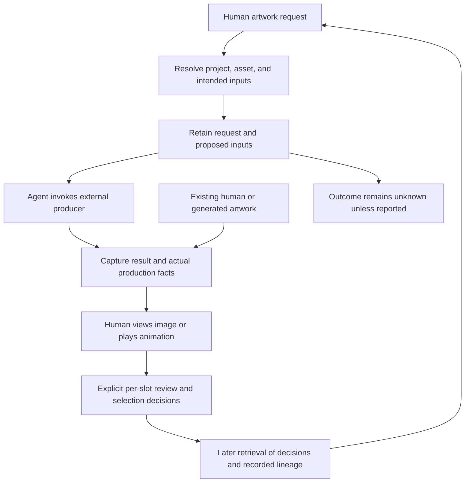
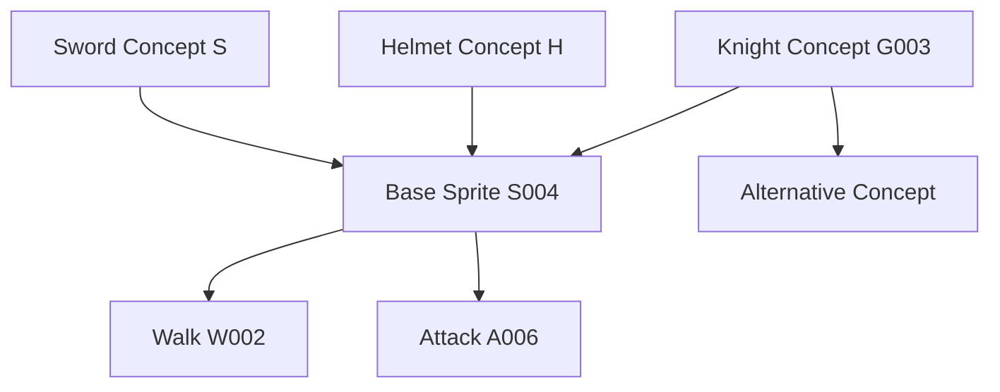
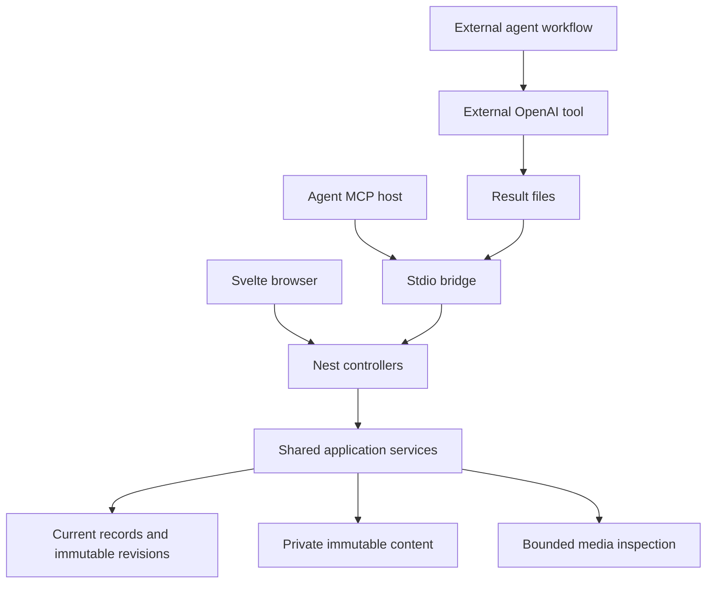
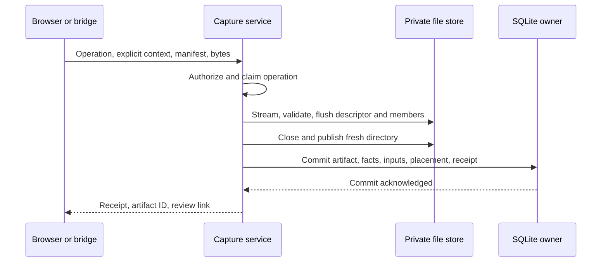
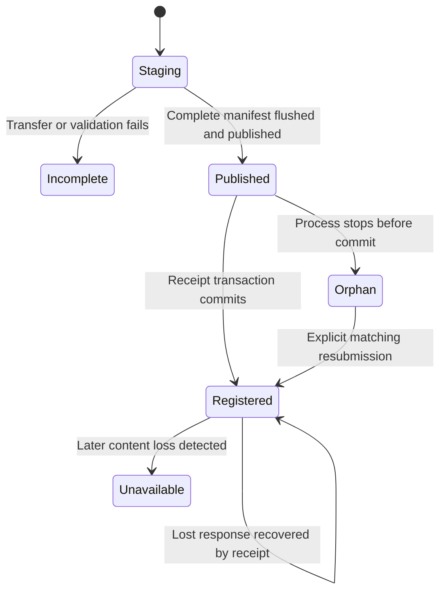
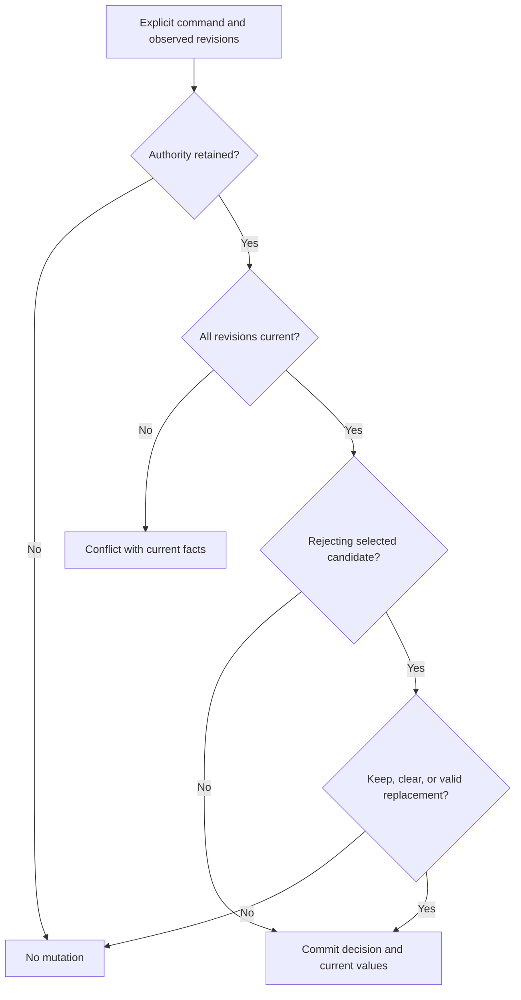
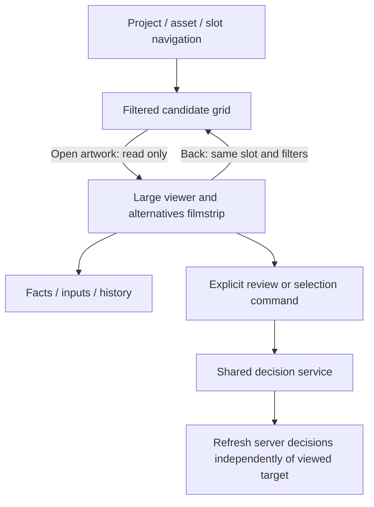

# AssetWeave First Complete Art Workflow - Plan

## Goal Capsule

- **Objective:** A developer and a fresh agent can return to a game-art asset, recover how its artwork came to exist, and continue work without reconstructing history from memory, old chats, or unrelated folders.
- **Product authority:** `STRATEGY.md` remains authoritative and unchanged. This Product Contract defines the first complete workflow within its four tracks.
- **Means:** NestJS/Fastify local service, Svelte browser UI, SQLite records, immutable content, and an MCP stdio bridge (KTD1–KTD4).
- **Execution:** Complete U1–U11 against the existing checkout, preserving the runtime and partial catalog implementation. The implementing agent owns code, documentation, and runtime proof; the developer supplies creative decisions and participates in final acceptance.
- **Stop conditions:** Do not substitute a mocked producer for AE17, silently change the Product Contract, or report completion without the required acceptance evidence. Missing external credentials block the producer demonstration, not local implementation.
- **Acceptance prerequisites:** Authorized OpenAI access and founder participation remain necessary for final acceptance, not for local implementation.

---

## Product Contract

### Summary

AssetWeave will provide a local artwork workflow for finding artifacts, inspecting their production history, reviewing alternatives, and continuing work through external tools.
The human reviews images and animations and makes creative decisions; AssetWeave exposes recorded information without assessing the artistic state of the work.
Agents retrieve relevant context and handle execution and recordkeeping through the same domain model as the human interface.
The complete workflow will use a NestJS/Fastify backend shared by a Svelte browser interface and MCP, with SQLite metadata and immutable local artwork files.

### Problem Frame

The founder returned to artwork and could not remember how it had reached its current form.
The agent also lacked that context, leaving neither participant able to reconstruct the work reliably.
A file existing somewhere did not answer which inputs produced it, which direction had been chosen, or what had already been tried.

The desired improvement is recoverable evidence, not an automatically assigned assessment of progress.
The developer wants to inspect and filter the available information and judge the work personally.

### Key Decisions

Each entry records why a choice was made; its governed requirements own the behavior.

- **Human interpretation, optional stage label.** Governs R12, R21, R22, R37. The label expresses the developer's own assessment rather than a computed pipeline position. (session-settled: user-directed — chosen over no stage label: retain an optional human declaration without having AssetWeave assess progress.)
- **User-defined selection slots.** Governs R13, R14. Named purposes accommodate concepts, sprites, actions, and directions without fixing a creative taxonomy. (session-settled: user-directed — chosen over artifact-kind or structured-attribute selection scopes: organize choices using the developer's own purposes.)
- **Approval per slot, independent selection.** Governs R16–R19. Acceptability and the current working choice answer different questions. (session-settled: user-directed — chosen over approval-gated selection and artifact-wide approval: preserve working choices and suitability for each use independently.)
- **Explicit choice when rejecting a selection.** Governs R19. A contradictory pair of decisions must be intentional. (session-settled: user-directed — chosen over silent retention or automatic clearing: ask whether to keep, clear, or replace the selection.)
- **Reviewed but undecided is meaningful.** Governs R16. Viewing artwork alone is not a recorded review. (session-settled: user-directed — chosen over one undifferentiated undecided state: distinguish deliberate review from work not yet reviewed.)
- **Agents may relay authorized decisions.** Governs R8, R38. The human remains the decision-maker without being forced into the UI for every action. (session-settled: user-directed — chosen over UI-only decisions: allow an agent to record the specific human instruction.)
- **Task-scoped context with further retrieval.** Governs R5–R7. Recovery starts with relevant facts rather than either an empty index or the complete history. (session-settled: user-directed — chosen over index-only and full-history retrieval: provide enough context to resume while retaining access to the rest.)
- **Clarify ambiguity before production.** Governs R7. A provisional artistic choice is not a substitute for missing human intent. (session-settled: user-directed — chosen over disclosed provisional choices: resolve uncertain project, slot, or source identity before producing artwork.)
- **Retain requests even without outputs.** Governs R9, R10, R34. Interrupted work still has recoverable intent. (session-settled: user-directed — chosen over result-only recording: preserve attempts whose outcome may remain unknown.)
- **Snapshot capture and optional slot placement.** Governs R15, R28, R29. Capture preserves a result without requiring an immediate judgment about its use. (session-settled: user-directed — chosen over live external-file tracking and mandatory slot assignment: retain exact artwork while allowing later organization.)
- **Images and animation playback first.** Governs R24–R27, R46. Native editor support is deferred without defining all future artifacts as image files. (session-settled: user-directed — chosen over native Krita/Aseprite support in the first slice: deliver image review and spritesheet playback first.)
- **Regular grids with local playback descriptions.** Governs R25–R27. Missing animation metadata can be supplied without adding an artwork editor. (session-settled: user-directed — chosen over irregular-atlas playback and externally supplied metadata only: support common sheets and human playback setup locally.)
- **Named clips can be decision targets.** Governs R14, R40. A sheet need not be duplicated to make different decisions about its animations. (session-settled: user-directed — chosen over whole-artifact decisions only: select or approve the specific animation used by a slot.)
- **Input roles are recorded when known.** Governs R32–R34. Starting artwork and a visual reference can have different uses in the same production step. (session-settled: user-directed — chosen over undifferentiated inputs: preserve stated uses without inferring unknown roles.)
- **Older sources are found through lineage and filters.** Governs R22, R36, R37. A changed source selection is not evidence that descendants are unusable. (session-settled: user-directed — chosen over automatic source-difference indicators: expose relationships without assigning attention or validity labels.)
- **All candidates are visible by default.** Governs R20. A creative decision does not silently remove a direction from ordinary browsing. (session-settled: user-directed — chosen over excluding rejected candidates by default: let the developer choose the filtering.)
- **Corrections retain their history.** Governs R39, R40. Correcting a mistake must not erase what was previously recorded. (session-settled: user-directed — chosen over replacement-only metadata: preserve the change, recorder, and time.)
- **Selected clips follow corrections.** Governs R40. A selection continues to identify the named clip while earlier decisions and production inputs keep their historical meaning. (session-settled: user-directed — chosen over keeping the selection pinned until reselection: ordinary playback uses the corrected clip description.)
- **Core filters plus full-text search.** Governs R22, R23. Producer-specific information remains accessible without requiring a general parameter-query system. (session-settled: user-directed — chosen over arbitrary parameter filtering: prioritize the common retrieval workflow.)
- **OpenAI is the first producer exercised.** Governs R45. It supplies a concrete interoperability check, not the domain model. (session-settled: user-directed — chosen over PixelLab and ComfyUI for the first round trip: ground initial coverage in the founder's selected workflow.)
- **Compact Designer visual baseline.** Governs R47. The rendered revision is accepted as a starting point for implementation, not a permanent design freeze. (session-settled: user-approved — chosen over the earlier heavier treatment and spacious-gallery alternative: retain information density with quieter visual structure; later revision and improvement are allowed.)
- **Workbench browsing with artwork-first review.** Governs R48. The combined arrangement keeps project context available while making opened artwork the main focus. (session-settled: user-approved — chosen over the table-first arrangement and a grid-only workbench after reviewing the combined prototype.)

### Actors

- A1. **Developer:** requests artwork, supplies context, reviews results, records creative decisions, and decides what to do next.
- A2. **Agent:** retrieves records, resolves ambiguity with A1, invokes external tools, and records results and explicitly authorized decisions.
- A3. **External producer:** a generator, editor, or human workflow that supplies artwork and whatever production information is available.
- A4. **AssetWeave:** preserves and retrieves local records, displays supported artwork, and exposes the same domain to A1 and A2.

### Requirements

**Agent-driven workflow continuity**

- R1. The product must honor the boundaries and actor responsibilities in `STRATEGY.md`; this contract does not replace or reopen that authority.
- R2. Project organization, capture of available local files, retrieval, review, playback, and human decisions must remain useful locally without a cloud account, hosted service, or available generator.
- R3. Humans and agents must be able to establish, create, find, and annotate projects and logical assets without treating filesystem locations as their identities.
- R4. The local human interface and first-class MCP agent interface must operate on the same artifacts, relationships, requests, and decision records.
- R5. Initial task-scoped context must include project and asset identity, recorded human notes, slots and their selections, target-slot candidates and decisions, and the provenance and inputs of relevant selected or explicitly requested artifacts.
- R6. Context retrieval must expose how to obtain the remaining records, deeper lineage, and downstream dependencies without representing a bounded result as the complete history.
- R7. Ambiguity about the project, destination slot, or intended source artwork must be resolved with the human before new artwork is produced; approval, recency, or prior use must not silently substitute for selection or explicit instructions.
- R8. Agents may record review, selection, and stage decisions only under an explicit human instruction that is retained as the decision's authority.
- R9. When work is known in advance, AssetWeave must retain its request, project and asset context, intended destination when known, proposed inputs, and recording actor and time before external production.
- R10. A known request must retain its captured results and reported outcome, including failure or cancellation when reported; an unreported outcome remains unknown.
- R11. After recording external results, an agent must be able to present those captured candidates and their recorded context for human review without treating capture as a creative decision.

**Asset review and decision clarity**

- R12. A logical asset may have an optional human-set stage label that is visible and filterable, with absence explicit and no assignment or update derived from artifact activity.
- R13. A logical asset must support user-defined named slots representing purposes such as Concept, Base sprite, Walk / north, or Attack / sword.
- R14. A slot candidate may target a whole artifact or a named animation clip within a captured spritesheet, and the same target may participate in multiple slots with independent decisions.
- R15. Capture must allow an artifact to remain unslotted under its project and logical asset until its purpose is established.
- R16. Each candidate's per-slot review state must be unreviewed, reviewed-undecided, approved, or rejected, beginning unreviewed and changing only through an explicit human decision rather than viewing or playback.
- R17. A slot must allow multiple approved candidates simultaneously.
- R18. A slot must allow zero or one current selection independently of approval, including an explicit absence of selection and selection of an unapproved working direction.
- R19. Rejecting a currently selected candidate must require the human to explicitly keep, clear, or replace that selection as part of the decision.
- R20. Ordinary candidate browsing must include all candidates by default, retaining rejected and formerly selected work for later filtering, comparison, and reuse rather than using deletion as creative-state management.
- R21. Review must make the candidate's asset, kind, origin, known and unknown provenance, recorded inputs, alternatives, per-slot decisions, current selection or its absence, downstream relationships, and available human decision actions accessible.
- R22. Core filters must cover project, logical asset, slot or unslotted placement, human stage, artifact kind, review state, selection, producer, dates, and recorded ancestors or descendants, distinguishing capture dates from known production dates.
- R23. Full-text search must cover recorded names, notes, prompts, and other textual metadata, while producer-specific parameters remain inspectable without requiring arbitrary field-level parameter filtering.
- R24. Required first-version media coverage must include PNG images, PNG spritesheets, PNG frame sequences, and GIF images and animations, with frame sequences represented as a single captured creative result rather than unrelated frame records.
- R25. Regular grids and strips must support locally recorded cell geometry, named clips, frame order, and timing supplied by a human or agent with its source retained.
- R26. Humans must be able to view supported images and play their animations, including choosing a named clip, with frame count, duration, and playback rate available when determinable from the recorded or encoded timing.
- R27. A spritesheet without sufficient valid playback information must remain reviewable as a still image with playback explicitly unconfigured, and irregularly packed atlases are still-image-only in this slice.

**Trustworthy lineage and history**

- R28. Capture must preserve the exact contents of an artifact independently of later edits, moves, or deletion of its external original, with an edited result captured as a new artifact rather than replacing prior contents.
- R29. AssetWeave must not report successful capture unless the complete content represented by that artifact has been preserved locally.
- R30. Provenance must retain supplied producer, production time, model or version, prompt, negative prompt, seed, parameters, and human or agent context when available, with capture time kept distinct from production time.
- R31. Provenance must distinguish the source of recorded claims and explicit unknowns from known values or a positively recorded absence, without reconstructing missing facts as certainty.
- R32. Recorded derivation must support one or multiple exact artifact inputs, branching, and inputs from different logical assets without flattening the history into a revision sequence.
- R33. Each input relationship must retain its stated use when known, such as starting artwork or visual reference, and otherwise leave that role unspecified.
- R34. Actual recorded inputs must remain distinct from proposed request inputs and current selections, with no relationship inferred merely from filenames, similarity, ordering, or a planned association.
- R35. Earlier, rejected, and formerly selected artifacts must remain usable as explicit inputs without changing their existing creative decisions.
- R36. Humans and agents must be able to traverse recorded inputs and downstream dependents across multiple steps, stopping at and identifying missing or unavailable history rather than inventing a complete chain.
- R37. Replacing or clearing a selection must not change descendant lineage, approval, or selection, and AssetWeave must not automatically label those descendants stale, affected, invalid, or in need of regeneration.
- R38. Creative decisions must retain their target, recorded human authority, recording actor, time, previous and new values, and any supplied rationale rather than overwriting the earlier decision.
- R39. Corrections to metadata or input relationships must use the corrected information in normal views while retaining the prior record, change, recording actor, and time in history.
- R40. Playback descriptions referenced by recorded clip decisions or inputs must remain recoverable so later corrections do not rewrite the meaning of those historical records. A current selection follows the corrected description of the same named clip; historical decisions and actual production inputs retain the exact playback revision they referenced.

**Generator-independent interoperability**

- R41. Registering artwork must minimally require preservable content and an established project and logical asset, without requiring a known producer, managed request, slot, approval, selection, or complete provenance.
- R42. For work known in advance, an agent must be able to invoke an external producer independently and register its outputs against the retained request with the actual inputs and production information available.
- R43. Existing human-created or externally generated artwork must be registerable afterward through the human or agent interface without inventing a prior managed request or missing production history.
- R44. Integration-specific metadata and capabilities must remain optional, so a producer exposing only artwork can use the same artifact and lineage model as a producer exposing richer generation context.
- R45. The first complete workflow must exercise an actual agent-to-OpenAI-image-generation-to-capture round trip without making OpenAI availability or credentials a condition of using the local application.
- R46. Artifact identity, decisions, and lineage must remain independent of the initial image encodings, allowing later native Krita/Aseprite support to join the same history model without requiring native decoding or editing in this slice.

**Approved browser design baseline**

- R47. The main artwork interface must use the approved Designer revision as its current visual baseline: compact information density, quiet neutral surfaces, fewer decorative boxes and borders, clear typography, and restrained interaction accents, while retaining legible text, visible controls and focus, and distinct textual cues for review, viewing, and slot selection. The preserved prototype supplies the visual reference, not production data or shipped code. Approval permits later refinement; it does not freeze pixel values or choose a preferred default between the existing dark and light treatments.
- R48. On desktop, the main artwork workbench must retain project/asset/slot navigation on the left and a contextual record inspector on the right. Slot browsing presents a central candidate grid; opening an individual artwork replaces that grid with a large viewer and an alternatives filmstrip without changing the slot's selection or review decisions. Returning to candidates restores the same slot and filters. On narrow screens, navigation and record details remain accessible through the prototype's drawer and disclosure arrangement rather than forcing three columns.

### Key Flows

- F1. **Request, produce, capture, review.** Covers R3–R11, R16–R19, R28–R34, R41, R42, R45.
  - **Trigger:** The developer requests new artwork for an existing or newly established logical asset.
  - **Steps:** The agent resolves context and any ambiguity, retrieves relevant facts, and records the request. It invokes the external producer independently, then captures results and actual production information. The developer inspects candidates and makes any desired review or selection decisions.
  - **Outcome:** The result is recoverable with its request and recorded inputs even if no candidate is approved or selected.

- F2. **Register artwork after production.** Covers R15, R16, R24, R28–R31, R36, R41, R43.
  - **Trigger:** A human or agent already has artwork produced outside a known AssetWeave request.
  - **Steps:** Establish the project and logical asset, capture the content, attach available facts and explicit input relationships, and optionally assign slots. Leave missing history unknown.
  - **Outcome:** The artwork enters the same review and lineage workflow as an output of F1, without a fabricated session history.

- F3. **Review images and animations.** Covers R14, R16–R27, R38–R40, R47–R48.
  - **Trigger:** The developer finds candidates through browsing, filtering, search, or an agent's presentation.
  - **Steps:** Inspect the image or play the relevant animation, consult supplemental facts and provenance as needed, and compare available candidates. Configure missing regular-grid playback information when known. Record a review decision, selection, or deliberate absence of selection.
  - **Outcome:** The human's decisions are recorded for the particular purpose and target without being inferred from viewing behavior.

- F4. **Derive and revisit branches.** Covers R5–R7, R20–R23, R32–R40.
  - **Trigger:** Further artwork uses one or more earlier artifacts, or a developer returns after time has passed.
  - **Steps:** Find the intended asset and slot, inspect relevant choices and their histories, traverse exact recorded inputs or dependents, and identify unknowns. Resolve any ambiguous next request and continue through F1 using explicitly chosen inputs.
  - **Outcome:** Neither a replaced selection nor a rejected direction removes the evidence needed to resume.

The workflow retains a request even when no result reaches capture, per R9–R10.

The following example illustrates fan-in and branching under R32–R37; each arrow exists only when the relationship was recorded.

### Acceptance Examples

- AE1. **Local use without a generator.** Covers R2–R4, R12, R15, R16, R18, R41, R43.
  - **Given:** No external generator is reachable and no cloud account is configured.
  - **When:** The developer creates a project and Knight asset, captures a local PNG, and later reopens AssetWeave.
  - **Then:** The artifact and records remain available locally. No stage, slot assignment, approval, or selection has been fabricated.

- AE2. **Capture is not a live external-file reference.** Covers R28, R29.
  - **Given:** A PNG has been successfully captured.
  - **When:** Its original external file is edited, renamed, or removed.
  - **Then:** The captured artifact still displays the original content. Capturing the edited output produces another artifact, not a replacement for the first.

- AE3. **Purpose-specific decisions.** Covers R13–R18, R38.
  - **Given:** The same image is a candidate in Concept and Portrait, and a second image is also approved in Concept.
  - **When:** The developer approves the first image for Concept but rejects it for Portrait.
  - **Then:** Both Concept approvals coexist, the Portrait rejection remains separate, and either slot can remain explicitly unselected.

- AE4. **Selection is not approval.** Covers R18, R19, R38.
  - **Given:** An unapproved attack candidate is selected as the working direction.
  - **When:** The developer rejects it for that slot.
  - **Then:** The decision requires an explicit keep, clear, or replace choice. Keep records an intentionally rejected-but-selected candidate; clear leaves no selection; replace uses the candidate explicitly chosen by the human.

- AE5. **Viewing and authorized decisions differ.** Covers R8, R16, R38.
  - **Given:** A newly assigned candidate is unreviewed.
  - **When:** A human or agent opens or plays it without making a decision.
  - **Then:** It remains unreviewed. A later human instruction to mark it reviewed-undecided is recorded as that human's decision, even if an agent performs the recordkeeping.

- AE6. **No computed stage or hidden history.** Covers R12, R20–R23.
  - **Given:** Knight has the human-set stage label Exploring, mixed artifact types, and rejected and formerly selected candidates.
  - **When:** New animations are captured and the asset is browsed.
  - **Then:** The label stays Exploring and all candidates remain in the default set. The developer can filter by recorded facts and search a remembered prompt or note without receiving a system-assigned progress judgment.

- AE7. **Multi-input derivation and reuse.** Covers R31–R36.
  - **Given:** A Knight sprite was produced from a Knight concept, a helmet reference, and a rejected sword direction belonging to another logical asset.
  - **When:** Those exact inputs are registered, with a known role for the helmet and an unknown role for the sword.
  - **Then:** All three inputs are traceable. The sword's role remains unspecified and its rejection remains unchanged. Another output can branch from any of those earlier inputs.

- AE8. **Selection changes do not invalidate descendants.** Covers R20, R22, R36–R38.
  - **Given:** G003 leads to S004, which leads to W002 and A006 through recorded relationships.
  - **When:** G005 replaces G003 in the Concept slot.
  - **Then:** Traversing or filtering descendants of G003 still finds W002 and A006. Their decisions and inputs do not change, G003's prior selection remains in history, and no automatic stale or affected label appears.

- AE9. **Unknown outcomes and actual inputs.** Covers R9, R10, R29, R34, R42.
  - **Given:** A retained request proposes G003 as an input, but the external session ends without reporting a result.
  - **When:** The request is retrieved later.
  - **Then:** Its outcome is unknown, not success or failure. If an output is subsequently captured with G005 recorded as its actual input, its lineage uses G005 while the original proposal remains inspectable.

- AE10. **After-the-fact registration does not manufacture history.** Covers R30, R31, R36, R41, R43, R44.
  - **Given:** The developer imports an image export from a human editing workflow but does not know the original creation time, prompt, or exact source-file version.
  - **When:** The artifact is captured with the available information.
  - **Then:** Capture time is known, unavailable production facts remain unknown, and no managed request or exact source relationship is invented from a filename or external location.

- AE11. **Named clips within one sheet.** Covers R14, R24–R26, R38, R40.
  - **Given:** One captured regular-grid PNG sheet contains four walk frames at eight frames per second and four attack frames at ten frames per second.
  - **When:** The clips are described and played, and the developer selects each for its corresponding slot.
  - **Then:** Walk plays its recorded four-frame sequence with a 0.5-second cycle and Attack plays its own with a 0.4-second cycle. The slots reference their respective clips within the same artifact and may carry different approvals.

- AE12. **Unknown playback data remains unknown.** Covers R25–R27, R31, R39.
  - **Given:** A regular-grid sheet is captured without reliable cell geometry or timing.
  - **When:** It is reviewed.
  - **Then:** The still image is available and animation is explicitly unconfigured. Supplying the missing playback description enables playback and records who supplied it; the product does not invent timing from the pixels.

- AE13. **Animation format boundaries.** Covers R24–R28, R46.
  - **Given:** An animated GIF, a PNG frame sequence with recorded order and timing, and an irregularly packed PNG atlas are captured.
  - **When:** Each is reviewed.
  - **Then:** The GIF uses its encoded animation timing, the frame sequence plays in its recorded order, and the irregular atlas is available as a still image without promised atlas playback. Native Krita/Aseprite decoding is not required.

- AE14. **Corrections preserve what was recorded.** Covers R38–R40.
  - **Given:** An input link or a clip's playback description was recorded incorrectly.
  - **When:** A human or agent corrects that information.
  - **Then:** Normal views use the corrected value, while history identifies the previous entry and its correction. A current selection follows the corrected named clip, while earlier decisions and actual production inputs retain their referenced playback revisions.

- AE15. **A fresh agent can resume without memory.** Covers R5–R8, R21–R23, R30–R38.
  - **Given:** Knight has selected artwork, approved alternatives, attack candidates, older source branches, and some missing provenance.
  - **When:** A fresh agent receives “Make another attack animation for Knight.”
  - **Then:** It can retrieve the task-scoped facts and obtain deeper history as needed without old chats. If the project, attack slot, or intended inputs remain ambiguous, it asks before production rather than choosing the newest or approved candidate by default.

- AE16. **An unselected slot is a legitimate state.** Covers R7, R18, R34.
  - **Given:** The Attack slot has no selection, but the human explicitly identifies the project, destination slot, and intended source artifact for new work.
  - **When:** The agent prepares that work.
  - **Then:** It may proceed under the explicit instruction without first selecting a candidate or treating the absence of selection as an error.

- AE17. **Real producer interoperability.** Covers R9–R11, R28–R31, R41, R42, R44, R45.
  - **Given:** An agent has access to an actual OpenAI image-generation tool independently of AssetWeave.
  - **When:** It records a request, invokes that tool, and captures the returned image with available production context.
  - **Then:** The developer can retrieve and review the preserved image and its records. Unexposed settings remain unknown, and neither approval nor selection is granted automatically. Local use continues when the external tool is later unavailable.

- AE18. **Incomplete content is not successful capture.** Covers R9, R10, R28, R29, R41.
  - **Given:** A producer reports an output location, but the image cannot be obtained, or a multi-frame result is missing some of the content it claims to contain.
  - **When:** Registration is attempted.
  - **Then:** AssetWeave does not report that artifact as successfully captured. An existing request remains recoverable with the reported problem or unknown outcome instead of a fabricated complete artifact.

- AE19. **Browsing and artwork review preserve context.** Covers R16, R18, R20–R21, R47–R48.
  - **Given:** Knight / Attack has A006 selected and A004 as an approved alternative, and the developer has applied a review-status filter to its candidate grid.
  - **When:** The developer opens A004, inspects its facts, inputs, and history, then returns to candidates.
  - **Then:** The large viewer and alternatives are available alongside the record context on desktop; returning restores the slot and filter. A006 remains selected, no review decision is recorded by viewing, and the same navigation and record information remain accessible on narrow screens. The interface follows the approved compact visual baseline rather than treating the prototype's fictional records as catalog data.

### Success Criteria

Evaluation uses local project records and manual founder-workflow exercises, following `STRATEGY.md` under Key metrics.
The acceptance examples are the required behavior checks; the measures below assess whether the complete workflow solves the revisit problem.

| Measure | Exercise | Required evidence |
| --- | --- | --- |
| Asset-state clarity | Sample logical assets and their slots after mixed capture and decision activity. | The developer correctly identifies the human stage label or its absence, approved alternatives, and each slot's selection or explicit absence. Record the proportion correct against the local records. |
| Decision-ready retrieval time | Time a return to a known asset and intended result using only AssetWeave. | Record elapsed time until the developer has enough context to make the next iteration decision, without old chats or unrelated folders. Establish a baseline rather than impose an invented numeric threshold. |
| History reconstruction success | Sample results containing branches, multiple inputs, and missing provenance. | The developer and a fresh agent trace the exact recorded inputs, known production steps, and decisions. Record the proportion reconstructed correctly; correctly identifying missing history counts as truthfulness, not recovered history. |
| Workflow continuity | Complete F1 and F2, then revisit through F4 after restarting and discarding conversational context. | Captured content, decisions, requests, and lineage remain sufficient to continue from recorded facts under R5–R11 and R28–R40. |
| Local independence | Repeat local retrieval and review without an available generator or hosted account. | The local behaviors in R2 remain usable; the optional external producer is needed only for its own production step. |

All conditional outcomes in AE1–AE19 must hold.
The successful first demonstration includes real externally generated artwork, an after-the-fact human image import, playable spritesheet clips, alternative decisions, a multi-input branch, a changed selection with older descendants, and an explicit unknown in the recovered history.

### Scope Boundaries

**Deferred for later**

- Native Krita/Aseprite decoding and review; supported image exports use R43 in the meantime, and future continuity is governed by R46.
- Irregular-atlas animation playback, specialized animation-analysis tools, and broader producer coverage beyond R24–R27 and R45.
- Arbitrary producer-parameter filtering beyond R22–R23.
- Godot synchronization, engine import, publishing, and in-game verification, as excluded from this slice by the art-workflow boundary in `STRATEGY.md`.

**Outside this product's identity**

- Artwork generation and artwork editing inside AssetWeave.
- Generic project management, team scheduling, studio collaboration infrastructure, enterprise DAM or permissions, and source-control replacement.
- Required cloud sync, hosted services, a generator marketplace, or an integration catalog pursued for breadth.

**Not implied by this contract**

- A job runner, scheduling system, retry orchestration, or ownership of external generator sessions; R9–R10 concern records of work, not execution management.
- Automatic reconstruction of unrecorded past conversations or production history; R31 and R36 govern gaps.
- Automatic artistic assessments, regeneration demands, or publication status; R12, R18, and R37 govern the relevant distinctions.
- Screen layouts beyond the approved browse/review baseline in R47–R48, or a prescribed database schema, endpoint or MCP tool vocabulary, storage hierarchy, ORM, or frontend component architecture.

### Dependencies and Assumptions

- The real producer demonstration in AE17 requires an agent with authorized access to OpenAI image generation. No claim is made that every tool or model exposes seeds, negative prompts, or reproducible settings; R30–R31 and R44 govern absent capabilities.
- Playback requires sufficient encoded or supplied timing and frame information. R25–R27 permit human-supplied descriptions without claiming those descriptions originated with the producer.
- Historical reconstruction is bounded by what was recorded or can be supplied truthfully. An old image can be preserved even when its production history cannot be recovered.
- Required first-version media coverage is specified by R24. Native source documents are not necessary for the first complete workflow.
- Founder exercises establish retrieval-time measurements before a numerical performance target is adopted.

### Outstanding Questions

**Resolve Before Planning:** None.

**Resolved through the prototype:** The main browse/review arrangement and the Designer's compact, minimal visual revision are accepted as the current baseline. Later improvements remain allowed; no preferred default theme was specified.

**Implementation planning:** The Planning Contract and U1–U11 cover R1–R48 and AE1–AE19 against the existing checkout. NestJS remains required; completed work and partial implementation are inputs to extend, not discard.

### Sources

- `STRATEGY.md`, especially Boundaries, Key metrics, and Tracks: authoritative product constraints and evaluation framework.
- Founder workflow evidence: both the developer and the agent failed to remember how an existing artwork result had reached its current form.
- User-reviewed visual prototype: `.context/compound-engineering/ce-prototype/2026-09-29-artwork-visual-style/01-visual-treatment/screens/`; approval and browser evidence in the run's `decisions.md`. These are ignored local design references, not tracked production assets. R47–R48 and AE19 preserve the governing decisions without requiring access to that local directory.
- The user's approval after reviewing the native Designer revision: “Let's go with that for the time being, we can always revise and improve.”

---

## Planning Contract

**Product Contract preservation:** Product Contract unchanged in scope, requirements, decisions, flows, and acceptance examples; its implementation-planning pointer now refers to the sections below.

### Repository Baseline

Extend the checkout rather than repeat workspace setup.
The previous plan at commit `05452b2` supplies the retained KTD1–KTD12 and U1–U11 identities and technical choices; current source, not that historical greenfield description, determines remaining work.

| Surface | Existing evidence | Remaining work |
| --- | --- | --- |
| Runtime | `apps/server/src/main.ts`, `apps/server/src/runtime/`, `apps/server/test/runtime.test.ts` | Preserve the loopback, pairing, profile ownership, and early authorization boundary as domain routes are added. |
| Persistence | `apps/server/src/database/database.service.ts`, `apps/server/src/database/migrations/001-domain.sql` | Complete and verify the partial schema, transactional history, migration upgrades, and multi-record operations. |
| Catalog | `apps/server/src/catalog/`, `packages/contracts/src/catalog.ts` | Preserve project/asset/slot CRUD, revision checks, normalized slot names, and candidate placement; add behavioral coverage and bounded retrieval. |
| Browser | `apps/web/src/App.svelte` | Retain pairing/connection access; add the actual artwork workbench and all domain forms. |
| Workflow | Schema tables and `apps/server/test/helpers/store-fixture.ts` | Implement requests, capture, media, corrections, decisions, search, and context. Fixture insertion is not production capture. |
| Agent interface | Bridge credentials in the runtime | Add `apps/mcp`; no stdio bridge or SDK dependency exists yet. |
| Verification | `docs/verification/first-art-workflow.md` | Historical U1 evidence only. Its claim that artwork design is unapproved is superseded by R47–R48; update it without presenting prototype checks as production acceptance. |

The runtime record reports a prior Windows build, typecheck, six runtime tests, and browser pairing smoke.
The approved prototype decision record describes U1 as verified and U2 as partial/unverified.
Neither statement establishes that the current partial domain code passes; this planning run performs no builds, tests, runtime probes, or generation.

The current domain migration has two concrete constraint gaps to resolve in U2:
- Several revision tables make `audit_event_id` unique, preventing multiple facts or input edges from sharing one capture event.
- `slot_selections` references `candidates(id, clip_id)` without a matching unique parent key.

The mutation service also rejects nested transactions.
U3–U6 therefore need transaction-scoped writes that a capture or compound decision can compose, rather than services recursively calling `DatabaseService.mutate`.

### Key Technical Decisions

- KTD1. **NestJS owns application behavior.** Keep TypeScript/pnpm workspaces, injectable Nest application services, thin controllers, explicit SQLite repositories, and shared Zod contracts. Svelte and MCP adapt the same domain operations; neither implements a second rules engine. Use `FastifyAdapter`, not plain Fastify or Express. Supports R3–R4. (session-settled: user-directed — chosen over plain Fastify: retain the requested NestJS backend.)

- KTD2. **One independently started local owner.** The existing Nest process serves the built Svelte SPA, API, and authenticated media on one loopback origin. The MCP host starts only a bridge; unavailable service means an actionable error, not another database or empty catalog. Preserve explicit startup/shutdown, canonical private profile discovery, exclusive live ownership, and confirmed-dead-owner recovery. No installer/autostart service is added. Supports R2, R4. (session-settled: user-approved — chosen over a desktop installer and independently writing MCP processes: launch from the project and keep one persistence owner.)

- KTD3. **Current relational records plus retained revisions.** Keep `node:sqlite`, parameterized SQL, foreign keys, WAL, FULL synchronous commits, and the existing mutation watermark. One short synchronous transaction owns expected-version checks, authority, audit, current records, revision rows, and search projections. Streaming and decoding stay outside it. One event may own multiple affected revision rows; compound writes receive its transaction context rather than nesting mutations. Protect retained revisions from update/delete while allowing current pointers to advance. Use forward migrations over existing version-1 data, never a destructive reset or a rewritten applied migration. Supports R9–R10, R31, R38–R40.

- KTD4. **Publish complete content before its database receipt.** Preserve the chosen per-capture immutable directory, ordered manifest, byte counts, and SHA-256 hashes. Stream to sibling staging, validate all represented members, flush files and a canonical recovery descriptor, close handles, publish to a fresh server-generated directory, then commit the artifact and all associations. Return success only after commit. An atomic in-flight operation claim and unique receipt prevent duplicate registration. Matching explicit resubmission returns the same artifact; changed complete bytes or context conflict. Equal bytes from distinct operations remain distinct artifacts. No external hard links, deduplication, overwrite, or remote-URL fetch. Supports R24, R28–R29, R41–R44. (session-settled: user-approved — chosen over storing artwork bytes in SQLite: keep metadata and immutable artwork files separate, with explicit crash reconciliation.)

  The descriptor binds operation identity, project/asset, optional request and placement, supplied facts, actual inputs, and the complete ordered member manifest.
  An explicit orphan resubmission must match it and revalidate references/cycles inside the registration transaction.
  In-flight duplicates expose an in-progress result and receipt lookup; they cannot replace an active transfer.
  Incomplete received bytes have no complete fingerprint and cannot be claimed as preserved.
  Startup reports incomplete staging, published orphans, and registered-but-unavailable content without auto-registering or deleting them.
  The private single owner reserves publication destinations; collisions fail without overwriting any directory.
  File flush and Windows rename do not create a hardware power-loss transaction across SQLite and the filesystem.

- KTD5. **Sourced assertions, not inferred provenance.** Preserve known-with-value, explicitly unknown, positively absent, and not-recorded states. Claim source differs from recording actor; capture time differs from production time. Retain nested producer metadata and index its textual leaves. Corrections append claim/input revisions and switch effective pointers. Supports R30–R34, R39, R44.

- KTD6. **Separate intention, derivation, and outcomes.** Requests retain immutable intent and proposed exact inputs. Outcome reports are separate revisions; no report means unknown, and capture does not overwrite a reported failure/cancellation. Actual inputs identify exact artifacts and known playback revisions, with nullable roles. Reject effective self-links/cycles without requiring chronological capture order. Gaps describe unavailable history rather than creating fictional source artifacts. Supports R9–R10, R32–R37, R42–R43.

- KTD7. **Stable clips with immutable playback revisions.** Candidates identify a whole artifact or stable clip in a slot. Current selected playback resolves that clip's current revision; historical decisions and actual-input edges resolve their pinned revisions. Corrections change neither review state nor selected candidate identity. Clip-targeted decisions submit the observed playback revision and conflict if it changed before commit. Unknown production playback revision becomes a known artifact input plus an explicit playback gap, never “latest.” Supports R14, R25, R38–R40, R46. (session-settled: user-directed — chosen over pinning current selection until reselection: implement the R40 distinction between current selected playback and historical referents.)

- KTD8. **Explicit, atomic creative commands.** Review, slot selection, and human stage remain separate. Selected-candidate rejection plus keep/clear/replace is one transaction with relevant candidate/slot revisions; replacement must belong to the slot. Agent decisions retain instruction text or an immutable local copy of referenced authority. Browser commands retain the deliberate action as authority. Record agent-relayed authority as reported, not verified human identity. Invalid authority, replacement, or revisions change nothing. Transport authentication alone is not creative authorization. Supports R8, R12, R16–R19, R38.

- KTD9. **Bounded retrieval with truthful continuation.** Use relational filters, recursive effective-lineage queries, and FTS5 over transactional current and revision-addressable historical text projections. Current text is the default; historical hits identify the matching revision. Backfill both scopes from existing records before enabling search. Keyset cursors bind query/filter/order and the global mutation watermark; any intervening mutation requires a fresh query instead of mixing snapshots. Context provides every R5 category, explicit truncation/continuation for each bounded collection or text field, and full-record retrieval. No artistic ranking or source recommendation. Supports R5–R7, R20–R23, R36.

- KTD10. **Thin MCP stdio adapter.** Use the supported MCP TypeScript server SDK, shared input/result contracts, and the operation families below. Resources and media tools identify artifacts/members by opaque IDs, with exact originals separate from bounded previews. The bridge reads only explicitly supplied local paths and streams bytes to HTTP; the server accepts bytes, never arbitrary server-local paths. Preserve service errors, keep stdout protocol-only, and send diagnostics to stderr. Notes, prompts, filenames, and metadata are recorded evidence, never tool instructions or human authority. Supports R4–R11, R41–R45.

- KTD11. **Preserved originals and sourced playback.** Use original PNG/GIF display, browser GIF decoding, bounded Sharp inspection/full validation, and a bounded GIF control-block reader to distinguish encoded timing from decoder defaults. Header metadata alone does not establish decodability; validate all bounded GIF frames. Regular grids and explicit PNG sequences use cumulative recorded durations in a canvas scheduler. Validate geometry, order, and positive supplied durations. Report encoded timing separately from viewer clamping; variable timings need no invented single FPS. Complete opaque/undecodable bytes may be captured under R41 but have unavailable preview, not a false supported-media claim. Only verified image types display inline; other originals download safely. Supports R24–R27, R31, R40, R46.

- KTD12. **Preserve the local trust boundary.** Keep exact Host/Origin/credentials in the existing early Fastify hook, before upload consumption. Retain loopback binding, disabled proxy trust/broad CORS, paired HttpOnly SameSite=Strict browser sessions, CSRF for browser mutations, and a separate per-start bridge bearer. Pairing remains short-lived, single-use, profile-bound, and absent from URLs/logs/MCP output. Verify Windows private-profile ACLs and reject substituted/reparse-point paths before migrations and content operations. Never serve the artwork directory as a static root. Use fixed verified MIME, `nosniff`, same-origin CSP, safe downloads, and inert rendering of recorded text. Same-user malware, administrators, and compromised MCP hosts remain outside this boundary.

- KTD13. **One production workbench with independent navigation state.** Build Svelte components around the R47–R48 baseline rather than transplanting prototype HTML/fixtures. Keep project/asset/slot IDs, filters, viewed target, and inspector tab as navigation state; review and selection come only from server records. Opening or changing the viewed target performs reads only. Back restores the slot/filter and refreshes records without silently changing filters. Preserve both theme treatments; use the operating-system preference on first use and a local explicit preference thereafter, without claiming the user selected a default. Supports R16, R18, R47–R48, AE19. (session-settled: user-approved — chosen over table-first and spacious-gallery arrangements: implement the accepted compact browse/review baseline, with later refinement allowed.)

### Dependencies and Integration Constraints

| Component | Checkout or planned baseline | Constraint |
| --- | --- | --- |
| Node / pnpm / TypeScript | Existing `>=24.21.0 <25` / `12.6.0` / `5.9.3` | Keep the pinned workspace and lockfile; isolate `node:sqlite` behind the existing database boundary. |
| Nest / Fastify / static | Existing Nest `11.2.6`, Fastify `5.11.3`, static `10.1.5` | Preserve `main.ts` adapter/static composition; do not introduce an incompatible `ServeStaticModule` peer set. |
| Svelte / Vite / plugin | Existing `5.57.1` / `8.3.1` / `7.3.1` | Continue the SPA, not SSR; built UI stays on the authenticated local service origin. |
| Shared validation | Existing Zod `4.6.5` | Export contract subpaths consistently with `packages/contracts/package.json`; update both interface callers on contract changes. |
| MCP | Planned `@modelcontextprotocol/server` `2.2.0` | Not installed. Confirm lockfile/runtime compatibility and actual host initialization during U8; do not use v1 SDK import recipes. |
| Image inspection | Planned Sharp `0.35.5` | Not installed. Verify Windows x64 native installation and bounded full-frame decode in U5. |
| Uploads | Planned Fastify-5-compatible multipart plugin | Pin its compatible version in U4; stream parts without body attachment/buffering. |

The existing SQLite capability checks remain: actual bundled SQLite at least 3.51.3, FTS5, foreign keys, WAL, FULL commits, and disabled extension loading.
U2 adds an ordered migration registry; reserve `002-domain-integrity.sql` for constraint corrections and `003-search.sql` for U7.
No OpenAI SDK or credentials enter the application dependency graph.

Upload limits cover member count, part/field size, per-file and aggregate bytes, and transfer completion.
A normal stream end is insufficient: truncation, duplicate/unexpected parts, missing members, abort, or malformed metadata prevents publication.
Media limits separately bound dimensions, frame count, aggregate decoded pixels, and decode work; Sharp's processing timeout does not bound queue wait.
Document concrete shipped limits and test their boundaries during implementation rather than inventing values here.

### High-Level Technical Design

**Component ownership**

**Capture protocol**

**Capture lifecycle**

**Decision branches**

**Workbench navigation**

On desktop, navigation and inspector remain beside the center view.
Narrow layouts expose navigation through a drawer and record details through a disclosure.
A viewed target outside a refreshed filter remains identified until the user leaves it; returning shows the refreshed filtered grid, including its empty state.
Browser back/forward and deep links resolve stable IDs without creating creative events.

### Shared Operation Surface

| Domain action | Browser surface | MCP family | Owning mechanism |
| --- | --- | --- | --- |
| Establish/find/create/annotate | Project and asset navigation/forms | Catalog operations | KTD1, KTD3 |
| Define slots/place candidates | Slot and unslotted views | Slot/candidate operations | KTD3, KTD7 |
| Retain request/report outcome | Request panel/forms | Request operations | KTD6 |
| Capture files | File picker/drop and sequence order form | Explicit local-file capture | KTD4 |
| Inspect/correct provenance and inputs | Record inspector/forms | Claim/lineage operations | KTD5–KTD7 |
| Describe/read media | Viewer and playback configuration | Playback/media tools/resources | KTD7, KTD11 |
| Review/select/set stage | Deliberate decision controls | Authority-bearing decisions | KTD8 |
| Search/recover/traverse | Filters, search, history, lineage | Search/context/history | KTD9 |

There is no generation operation.
The fresh-agent exercise must verify R7 as agent behavior: API validation cannot prevent an unrelated external tool invocation.

### Query, Error, and Navigation Contracts

- Preserve current slot normalization: Unicode NFKC, trimmed/collapsed whitespace, lowercase, unique within an asset. Same-named assets remain distinguishable by project and ID.
- Explicit placement can reuse another asset's artwork without changing ownership or inventing lineage. Display both slot context and original artifact context.
- Filters combine AND across categories and OR within a category. Review/selection refer to slot candidates, not artifact-wide approval. Unslotted means no whole-artifact or clip placement anywhere.
- Capture and production dates are separate filter dimensions. A known production-date range excludes unknown dates unless the user includes them explicitly.
- Lineage continuation includes direction, visited targets, frontier, and encountered gaps. Historical text matches retain revision identity while current detail uses effective records.
- Centralize the shared error envelope for invalid input, not found, revision conflict, missing authority, incomplete capture, content unavailable, and service unavailable. Keep safe details and current revisions available to both clients; never return success-shaped errors.
- An open form preserves its unsent input on conflict and requires a new deliberate submission. No automatic replay of creative commands.
- Retain pairing/connection routes alongside stable-ID project, asset, candidate, artifact, request, and historical-revision links. A locked session preserves the intended return destination but never displays stale private content as authenticated.
- Remote MCP changes are reconciled on explicit refresh, focus, and mutation completion; no new realtime subscription system is needed. Corrected playback refetches by revision, not only clip ID.

### Sequencing, Risks, and Sources

Preserve U1, complete U2, then build U3–U7 in dependency order.
U8 and U9 may integrate independently against those services; U10 completes review and U11 proves the whole workflow.
No unit is a substitute for complete acceptance.

Direct SQLite access from each bridge would split ownership; full event sourcing would add replay machinery; a desktop wrapper would add packaging without serving the required history semantics.
The retained filesystem choice accepts explicit reconciliation rather than moving artwork into database BLOBs.
No consequential mechanism remains open that requires competing implementations.

| Risk | Treatment and evidence |
| --- | --- |
| Partial schema predates service workflows | Forward migration and populated version-1 fixtures in U2; prove multi-fact/multi-input registration and historical clip referential integrity. |
| Filesystem publication and SQLite differ | KTD4 interruption/replay tests and unavailable-content reporting; no power-loss durability claim. |
| Upload/media exhaustion | Streaming, parser truncation checks, bounded decode outside transactions, lazy visible-frame loading, and boundary scenarios. |
| UI/MCP conflict or authority confusion | KTD7–KTD10 revision/authority enforcement in shared services; verify real mixed-interface operations. |
| Search diverges from revisions | Transactional maintenance and backfill of both current/history scopes; prove correction and rollback behavior. |
| Prototype copied as production truth | R47–R48 govern layout; real service data supplies every record. Six prototype crops remain fictional stills. |
| Provider or founder unavailable | Finish local work; keep AE17 and founder metrics explicitly unaccepted until exercised. |
| Sensitive local records leak | KTD12 actual listener/media tests; evidence contains no credentials, private artwork, or personal paths without authorization. |

The data profile stays on a local filesystem, outside the checkout and live sync roots.
Initial backup is a stopped-service copy of the complete profile, not a copy of an active SQLite main file alone.

Useful implementation evidence:
- `apps/server/src/database/database.service.ts`: migration ownership, expected revisions, transaction/projection hook.
- `apps/server/src/catalog/catalog.service.ts` and `catalog.repository.ts`: existing service/repository pattern.
- `packages/contracts/src/catalog.ts`: strict inputs and canonical slot-name normalization.
- `.context/compound-engineering/ce-prototype/2026-09-29-artwork-visual-style/decisions.md` and `.context/compound-engineering/ce-prototype/2026-09-29-artwork-visual-style/01-visual-treatment/screens/{index.html,styles.css,app.js}`: accepted local visual reference. These ignored files are optional implementation aids; R47–R48 and AE19 remain portable authority.
- [Fastify hooks](https://fastify.dev/docs/v5.11.x/Reference/Hooks/) and [multipart](https://github.com/fastify/fastify-multipart): KTD12 pre-body authorization and U4 streaming/truncation handling.
- [Node 24 filesystem API](https://nodejs.org/docs/latest-v24.x/api/fs.html): KTD4 flush/publication limitations.
- [SQLite transactions](https://www.sqlite.org/lang_transaction.html), [WAL](https://sqlite.org/wal.html), and [FTS5](https://www.sqlite.org/fts5.html): KTD3/KTD9 transaction, runtime, and projection constraints.
- [MCP 2.2.0 stdio](https://github.com/modelcontextprotocol/typescript-sdk/blob/v2.2.0/docs/serving/stdio.md), [SDK v2 tools](https://ts.sdk.modelcontextprotocol.io/v2/servers/tools.md), and [resources](https://ts.sdk.modelcontextprotocol.io/v2/servers/resources.md): KTD10; verify actual host handling of structured results and media.
- [Sharp installation](https://sharp.pixelplumbing.com/install/), [metadata](https://sharp.pixelplumbing.com/api-input/), and [constructor](https://sharp.pixelplumbing.com/api-constructor/): KTD11 Windows packaging, header-versus-full decode, and limits.
- [GIF89a](https://www.w3.org/Graphics/GIF/spec-gif89a.txt): encoded timing versus viewer behavior.
- [OpenAI image generation](https://developers.openai.com/api/docs/guides/image-generation) and [deprecations](https://developers.openai.com/api/docs/deprecations): use a supported external capability at exercise time, not a fixed producer/model enum.

---

## Implementation Units

Existing U-IDs retain their original concern; file additions below are proposed unless listed in Repository Baseline.
Changes to shared contracts include their callers, exports, and package/test integration in the owning unit.

| U-ID | Change | Primary paths | Depends on |
| --- | --- | --- | --- |
| U1 | Preserve runtime and local boundary | `apps/server/src/runtime/`, `apps/server/src/main.ts` | None |
| U2 | Complete catalog and revision persistence | `apps/server/src/database/`, `apps/server/src/catalog/` | U1 |
| U3 | Requests, assertions, exact input history | `apps/server/src/requests/`, `apps/server/src/provenance/`, `apps/server/src/lineage/` | U2 |
| U4 | Complete immutable capture | `apps/server/src/capture/` | U2, U3 |
| U5 | Media and playback descriptions | `apps/server/src/media/` | U4 |
| U6 | Human-authorized creative decisions | `apps/server/src/decisions/` | U2, U5 |
| U7 | Filters, search, lineage, context | `apps/server/src/queries/` | U3–U6 |
| U8 | MCP stdio parity | `apps/mcp/` | U1, U7 |
| U9 | Browser organization and capture | `apps/web/src/features/catalog/`, `apps/web/src/features/capture/` | U4, U7 |
| U10 | Browser review, playback, correction | `apps/web/src/features/review/` | U5–U7, U9 |
| U11 | Complete workflow proof and docs | `tests/integration/`, `docs/verification/` | U8, U10 |

### U1. Runnable Nest workspace and local boundary

**Goal:** Preserve the existing runnable foundation while integrating domain routes.
**Requirements:** R1–R4; A1, A2, A4.
**Dependencies:** None.
**Files:** Existing root manifests/lockfile, `apps/server/src/main.ts`, `apps/server/src/app.module.ts`, `apps/server/src/runtime/`, `apps/server/test/runtime.test.ts`, `apps/web/src/App.svelte`, `packages/contracts/src/errors.ts`.
**Approach:** Retain the KTD1/KTD2/KTD12 implementation and historical verification, not rebuild it. Add only integration changes required by later units. Preserve static SPA fallback exclusions for API/media and profile ownership.
**Patterns to follow:** Existing early access hook, profile service, pairing flow, and real private-profile fixtures.
**Test scenarios:**
1. Existing ownership, pairing expiry/single-use, profile isolation, startup credential rotation, Host/Origin/CSRF, and API/media-not-found behaviors remain valid.
2. New protected upload/media routes reject unauthorized requests before file creation or private content delivery.
3. Direct authenticated workbench deep links load the SPA without turning unknown API/media paths into HTML.
**Verification:** Production service and browser pairing still operate on Windows after integration; no secret appears in logs or URLs.

### U2. Catalog, persistence, and revision records

**Goal:** Complete the existing catalog and make its persistence safe for compound workflow writes.
**Requirements:** R2–R4, R12–R15, R38–R40; F2, AE1.
**Dependencies:** U1.
**Files:** Existing `apps/server/src/database/database.service.ts`, `database.module.ts`, `apps/server/src/database/migrations/001-domain.sql` as migration input, `apps/server/src/catalog/`, `packages/contracts/src/catalog.ts`, `apps/server/test/helpers/store-fixture.ts`; new `apps/server/src/database/migrations/002-domain-integrity.sql`, `apps/server/test/database.test.ts`, `apps/server/test/catalog.test.ts`.
**Approach:**
1. Preserve partial code and characterize persisted behavior before altering its transaction mechanism.
2. Add ordered migration registration and a forward migration correcting audit-event cardinality, selection composite foreign keys, and retained-revision protections under KTD3.
3. Keep one mutation owner while allowing multiple transaction-scoped writes and one coherent before/after audit result.
4. Finish catalog error handling and behavioral coverage using current normalization and ownership rules.
**Patterns to follow:** `DatabaseService.mutate`, `CatalogRepository`, strict shared schemas; profile-backed fixtures use the private local-application-data convention, not an insecure shared temp root.
**Test scenarios:**
1. Covers AE1. Create project/asset/slots, restart, and retrieve unchanged IDs/notes with no fabricated stage or selection.
2. Same-named assets in different projects remain distinguishable; equivalent normalized slot names conflict within one asset.
3. A stale annotation correction changes neither current values, history, authority, nor watermark.
4. Upgrade a populated version-1 store without losing IDs/history/content references; failed migration rolls back schema/version, and unsupported newer schema is refused without mutation.
5. One compound mutation can retain several provenance/input revisions and a valid clip-selection history; incompatible parent/clip/slot references fail atomically.
6. Mutating or deleting retained revisions is refused, while a new revision and effective-pointer change succeed.
7. Projection failure rolls back all compound rows and the mutation watermark.
**Verification:** Real API catalog operations survive restart; migration and transaction proof uses real SQLite, not mocked repositories.

### U3. Requests, claims, and exact input history

**Goal:** Retain production intent and effective/historical evidence independently.
**Requirements:** R9–R10, R30–R39, R41–R44; F1, F2, F4.
**Dependencies:** U2.
**Files:** New `apps/server/src/requests/{requests.module.ts,requests.service.ts,requests.controller.ts}`, `apps/server/src/provenance/provenance.service.ts`, `apps/server/src/lineage/lineage.service.ts`, `packages/contracts/src/production.ts`, `apps/server/test/production.test.ts`, `apps/server/test/lineage.test.ts`; existing application-module/contracts exports.
**Approach:** Implement KTD5–KTD6 over the retained schema. Expose request/outcome, assertion/correction, input/gap, and history operations; use transaction-scoped writes for later capture composition. Do not build a producer runner.
**Patterns to follow:** U2 revision checks and transaction ownership; provider-independent assertion records.
**Test scenarios:**
1. Covers AE9. A retained request proposes G003, later result uses G005, and an unreported outcome remains unknown after restart.
2. Covers AE10. Omitted prompt, unknown seed, absent negative prompt, and supplied values retain distinct states and sources.
3. Covers AE7. Three inputs across assets preserve roles; a rejected input remains rejected when reused.
4. Covers AE14. Correct/retract an input edge: effective traversal changes, earlier edge and actor/time remain accessible, and cycle/self-link attempts leave no mutation.
5. A reported failure/cancellation remains inspectable after later capture; invalid project/asset/request associations fail.
**Verification:** Public service operations retrieve a request, multi-input branch, correction, and explicit gap from a restarted real store.

### U4. Immutable complete capture

**Goal:** Preserve one complete creative result independently of external files.
**Requirements:** R11, R15, R24, R28–R31, R34, R41–R44; F1, F2.
**Dependencies:** U2, U3.
**Files:** New `apps/server/src/capture/{capture.module.ts,capture.service.ts,capture.controller.ts,content-store.ts,reconcile.ts}`, `packages/contracts/src/capture.ts`, `apps/server/test/capture.test.ts`, `apps/server/test/capture-recovery.test.ts`; existing server manifest, lockfile, module and contract exports.
**Approach:** Implement KTD4 streaming, claims, descriptors, receipt lookup, and explicit resubmission. Commit artifact, members, facts, actual inputs, optional request link, and placement together via U2/U3. Authenticate before parsing; preserve KTD12 on every content path.
**Patterns to follow:** Existing early Fastify authorization and profile directories; U3 transaction-scoped writes.
**Test scenarios:**
1. Covers AE2. Edit/delete the external original; retrieved bytes retain the captured hash, and new capture creates another artifact.
2. Covers AE18. Missing/duplicate sequence member, truncated part, aborted stream, byte limit, disk failure, or publication failure produces no successful artifact.
3. Interrupt before publication, after publication, and after database commit; restart distinguishes incomplete staging, orphan, and committed receipt.
4. Identical explicit resubmission after lost response returns one artifact; changed bytes/context under the same operation conflict. Concurrent submissions cannot replace the active transfer or committed receipt.
5. Matching orphan replay revalidates current references/cycles; changed request, facts, or inputs cannot reuse its descriptor.
6. Covers AE1 / AE10. Minimal unslotted import needs no producer/request; complete opaque bytes have unavailable preview rather than failed preservation.
7. Real API capture stores several facts and three actual inputs atomically; a final association failure leaves no registered artifact or partial history.
8. Path-shaped metadata cannot read server files or escape the store; unexpected parts and destination collision cannot overwrite preserved content.
**Verification:** Exercise real Windows files, a complete sequence, explicit receipt recovery, and process interruption. Hash originals after restart; do not infer power-loss guarantees.

### U5. Media and versioned playback descriptions

**Goal:** Serve supported captured media and sourced current/historical playback descriptions.
**Requirements:** R14, R24–R27, R31, R39–R40, R46; F3.
**Dependencies:** U4.
**Files:** New `apps/server/src/media/{media.module.ts,media.service.ts,media.controller.ts,gif-controls.ts}`, `packages/contracts/src/media.ts`, `packages/contracts/src/playback.ts`, `apps/server/test/media.test.ts`, `apps/server/test/playback.test.ts`, `tests/fixtures/media/`; existing dependency/module/contracts integration.
**Approach:** Implement KTD7/KTD11 authenticated content resolution, bounded validation, named clip revisions, and explicit unavailable states. Resolve complete originals independently of preview eligibility. Validate metadata outside transactions; recheck mutable revisions when committing corrections.
**Patterns to follow:** U3 sourced assertions, U4 immutable manifests, U2 revision checks.
**Test scenarios:**
1. Covers AE11. Four-frame clips at eight and ten FPS report 0.5- and 0.4-second cycles on one sheet.
2. Covers AE12. Missing timing/invalid geometry leaves still review and unconfigured playback; valid sourced description enables it.
3. Covers AE13. Variable-delay/disposal GIF, explicitly ordered PNG sequence, and still-only irregular atlas retain their distinct behavior.
4. Absent/zero GIF timing is not reported as a known positive encoded duration; corrupt later GIF frames and decode-budget excess cannot pass as validated media.
5. Covers AE14. Correct playback: current revision changes, pinned input/history revision stays retrievable, stale correction fails without writes.
6. Missing/corrupt stored content reports unavailable while metadata/history remain readable; opaque originals cannot execute on the application origin.
**Verification:** Inspect real media bytes and metadata; U10 must additionally observe displayed frames and timing. Parser tests alone are insufficient.

### U6. Human-authorized creative decisions

**Goal:** Record explicit, independent review, selection, and stage decisions.
**Requirements:** R8, R12–R20, R37–R40; F3.
**Dependencies:** U2, U5.
**Files:** New `apps/server/src/decisions/{decisions.module.ts,decisions.service.ts,decisions.controller.ts}`, `packages/contracts/src/decisions.ts`, `apps/server/test/decisions.test.ts`; existing error/module/contracts integration.
**Approach:** Implement KTD7–KTD8 with one compound rejection command, observed playback revisions, and retained authority. Current selected-clip reads follow corrections without manufacturing a selection event.
**Patterns to follow:** U2 transaction/conflict boundary; U5 stable clip and revision resolution.
**Test scenarios:**
1. Covers AE3. The same target has independent decisions in two slots; multiple approvals coexist with explicit no-selection.
2. Covers AE4. Keep, clear, and replace work atomically; missing disposition or replacement from another slot changes nothing.
3. Covers AE5. Reads/playback never record review; agent review/selection/stage without retained instruction is refused.
4. Covers AE8. Replace/clear Concept selection without modifying descendant inputs, reviews, or selections.
5. Concurrent UI/MCP commands from one revision yield one commit and one conflict; no authority/history/watermark leaks from the loser.
6. Covers AE14. Selected clip correction changes current playback while earlier decision/input pins remain; a stale observed playback revision cannot be silently accepted.
7. Cross-asset placement retains original ownership and slot-scoped decisions.
**Verification:** Live API exercises demonstrate atomic rejection, conflict handling, authority history, and current-versus-historical selected playback.

### U7. Filters, search, lineage, and task context

**Goal:** Retrieve the facts needed to resume without hiding records or overstating completeness.
**Requirements:** R5–R7, R20–R23, R30–R37; F4.
**Dependencies:** U3, U4, U5, U6.
**Files:** New `apps/server/src/database/migrations/003-search.sql`, `apps/server/src/queries/{queries.module.ts,search.service.ts,context.service.ts,queries.controller.ts}`, `packages/contracts/src/queries.ts`, `apps/server/test/search.test.ts`, `apps/server/test/context.test.ts`; existing database registry, catalog list callers, and contracts exports.
**Approach:** Implement KTD9, backfill current/history text, and register projection maintenance before serving mutations. Replace unbounded catalog lists with the shared bounded contract and migrate both clients. Preserve exact revision links, explicit gaps, and query-bound continuation.
**Patterns to follow:** Existing mutation watermark and `addProjection`; U3 effective/historical relationships.
**Test scenarios:**
1. Covers AE6. Default browse includes rejected/formerly selected work; each R22 filter and representative combinations return expected IDs.
2. Corrected prompts/nested text are searchable as current; superseded values appear only in explicit historical scope with revision identity.
3. Covers AE8. Multi-hop descendants remain reachable after reselection; gaps are returned rather than bridged.
4. Covers AE15. Oversized notes/candidate/lineage collections retain every R5 category plus working continuation; following pages recovers omitted records.
5. Watermark/query mismatch refuses continuation; equal timestamps do not duplicate or skip rows in a stable query.
6. Covers AE16. Explicit source plus unselected destination is representable; ambiguous names return alternatives, never an inferred choice.
7. Existing records are backfilled before search becomes available; correction/projection failure leaves records and index consistent after restart.
**Verification:** Public queries reconstruct an older branch in a real populated store, including historical text, missing history, and interrupted pagination.

### U8. MCP parity and local-file streaming

**Goal:** Give a fresh agent first-class access to the same durable operations and records.
**Requirements:** R3–R11, R21–R23, R38, R41–R45; F1, F2, F4.
**Dependencies:** U1, U7.
**Files:** New `apps/mcp/package.json`, `apps/mcp/tsconfig.json`, `apps/mcp/src/{main.ts,client.ts,tools.ts,resources.ts,capture-files.ts}`, `apps/mcp/test/stdio.test.ts`, `apps/mcp/test/parity.test.ts`; existing root scripts/lockfile and shared contract exports.
**Approach:** Implement KTD10 over public HTTP operations, not direct SQLite. Cover the Shared Operation Surface, errors, continuation, historical revisions, exact member reads, and bounded previews. Return IDs and browser deep links after capture; never infer a file read from recorded text.
**Patterns to follow:** Existing profile-bound bridge discovery and credential rotation; shared strict contracts.
**Test scenarios:**
1. Launch actual stdio bridge and Nest; create/request/capture/read via MCP and retrieve identical records/history via HTTP.
2. Service missing/restarted or wrong profile yields actionable failure without another store or phantom success.
3. Covers AE5. Authorized decisions retain instruction; missing authority and stale revisions preserve all state.
4. Covers AE18. Missing local frame or interrupted upload yields no complete artifact; explicit receipt lookup recovers lost responses.
5. Media tool/resource retrieves exact member bytes matching the stored digest; preview is labeled and cannot replace original access.
6. Initialization, tool errors, and logs preserve stdout protocol purity; continuation and recorded malicious prompt text never become tool instructions.
**Verification:** Initialize from the actual OMP MCP host and exercise tools/resources against Nest; inspect resulting records in the browser. A protocol-client test alone does not establish host interoperability.

### U9. Browser organization and capture

**Goal:** Make local organization, discovery, and import usable through the approved workbench.
**Requirements:** R2–R4, R13, R15, R20–R24, R28–R31, R41, R43, R47–R48; F2, F4, AE19.
**Dependencies:** U4, U7.
**Files:** Existing `apps/web/src/App.svelte`; new `apps/web/src/lib/api/{client.ts,navigation.ts}`, `apps/web/src/lib/components/{WorkbenchShell.svelte,FilterBar.svelte}`, `apps/web/src/lib/styles/tokens.css`, `apps/web/src/features/catalog/{ProjectBrowser.svelte,AssetBrowser.svelte,AssetDetail.svelte,CandidateGrid.svelte}`, `apps/web/src/features/capture/CaptureForm.svelte`, `apps/web/src/lib/capture-manifest.ts`, `apps/web/src/lib/capture-manifest.test.ts`, `apps/web/src/lib/navigation.test.ts`; existing web/root test integration.
**Approach:**
1. Implement KTD13 shell/tokens, stable-ID navigation, desktop columns, and narrow drawer/disclosure without fictional catalog fixtures.
2. Add editable project/asset notes, named slots, candidate placement, all core filters, search/history scope, and unslotted browsing.
3. Send explicit context and ordered file manifests to U4; present success only from a committed receipt, retaining the operation ID for deliberate recovery.
4. Preserve pairing and intended return links, form input on errors, and clear loading/empty/unavailable states.
**Patterns to follow:** Existing Svelte pairing/API boundary; accepted prototype composition and visual treatment under R47–R48, not its sample data or disabled functionality.
**Test scenarios:**
1. Manifest construction preserves nonlexical order and rejects missing/duplicate members; navigation state returns from a viewed target to the same slot/filter without encoding a creative mutation.
2. Covers AE1 / AE2 / AE10. Browser creates context, imports unslotted artwork, survives deletion of the original and service restart, and displays explicit missing provenance.
3. Every core filter is findable; default candidates include rejected work and duplicate asset names retain project context.
4. Interrupted capture never creates a success card; refresh does not silently repeat capture, and receipt recovery uses the original operation.
5. Manual desktop/narrow checks exercise both themes, keyboard drawer dismissal/focus return, details disclosure, and no page-level horizontal overflow.
**Verification:** Use the actual built browser with no generator configured and real records. Capture visual evidence of grid, navigation, import, and empty/error states; keep browser automation disposable unless it exposes an uncertain behavior worth a regression test.

### U10. Browser review, playback, and correction

**Goal:** Open artwork as the focus while retaining context and explicit decision/history controls.
**Requirements:** R8, R12, R14, R16–R27, R30–R40, R47–R48; F3, F4, AE19.
**Dependencies:** U5, U6, U7, U9.
**Files:** New `apps/web/src/features/review/{ReviewWorkspace.svelte,ArtifactInspector.svelte,AlternativesFilmstrip.svelte,MediaViewer.svelte,ClipEditor.svelte,DecisionPanel.svelte,HistoryPanel.svelte,RequestPanel.svelte}`, `apps/web/src/lib/playback.ts`, `apps/web/src/lib/playback.test.ts`; existing U9 shell/navigation/client.
**Approach:** Replace the grid center with large viewer and alternatives under KTD13; keep record inspector and slot context available. Add sourced facts, inputs/dependents, current/historical views, request/outcome forms, correction forms, stage/review/selection actions, and U5 playback. Use the filmstrip and opened artwork for comparison rather than introducing another top-level layout.
**Patterns to follow:** U9 tokens, navigation, forms, conflict handling; U5 revision-keyed media resolution.
**Test scenarios:**
1. Playback scheduling respects recorded nonlexical order and variable cumulative durations; missing/invalid timing never invents FPS.
2. Covers AE19. Open approved A004 from filtered Knight/Attack while A006 is selected; inspect facts/inputs/history, switch alternatives, return with same slot/filter, and verify no review/selection event.
3. Covers AE3–AE5. Browser records independent slot decisions, multiple approvals, explicit no-selection, reviewed-undecided, and reject keep/clear/replace.
4. Covers AE11–AE13. Observe both named clips, GIF disposal/timing, ordered sequence, and unconfigured/irregular still views; six prototype crops are never playback fixtures.
5. Covers AE14. Correct selected clip timing: current playback changes while previous decision and actual-input links open the pinned revision.
6. Correct sourced facts/input roles and traverse effective/historical lineage; request unknown/failed/cancelled outcomes stay distinct from capture.
7. An MCP change during a form yields conflict with unsent input preserved; filtered-out viewed artwork and unavailable content have explicit states.
8. Recorded HTML/script strings remain inert; both themes and desktop/narrow layouts retain textual viewed/selected/review cues, focus visibility, accessible controls, and inspector access.
**Verification:** Actual browser evidence shows artwork frames, playback behavior, controls, and context preservation at desktop and narrow widths. Compare against the approved visual reference without treating pixel values as frozen.

### U11. Complete founder workflow proof and operating documentation

**Goal:** Demonstrate recoverable artwork history after restart without old conversation.
**Requirements:** R1–R48; A1–A4, F1–F4, AE1–AE19.
**Dependencies:** U8, U10.
**Files:** New `tests/integration/workflow.test.ts`, `tests/integration/restart.test.ts`, integration test configuration; existing `package.json`, `README.md`, `docs/verification/first-art-workflow.md`.
**Approach:** Integrate the complete workflow and evidence matrix below. Wire all permanent test locations into the workspace gate. Document actual startup/MCP setup, private profile, backup/recovery, shipped limits, source/authority semantics, and generator-independent capture. Replace the stale design-approval sentence in the verification record while retaining its historical U1 evidence.
**Patterns to follow:** Product Contract acceptance examples and strategy measures; real stores/interfaces, no live producer in automated tests.
**Test scenarios:**
1. A real store retains content, requests, decisions, branches, and corrected clip history across process restart.
2. Mixed MCP/HTTP operations retain one shared state through reselection/reuse; unknown outcome and unknown provenance remain explicit.
3. Founder exercise covers real OpenAI request-before-production/capture, after-the-fact human import, clips, alternatives, multi-input branch, changed selection, older descendants, and an explicit unknown.
4. Fresh agent reconstructs without old chat, asks about ambiguous project/slot/source, and can proceed with explicit source for an unselected slot. A recorded prompt claiming approval or requesting private-file access is treated only as evidence.
5. Producer-unavailable exercise still supports local organization, capture, retrieval, playback, and decisions.
**Verification:** Record every acceptance outcome and founder measure with actual evidence. Missing external access or founder participation leaves final acceptance open, never replaced by a mock.

---

## Verification Contract

This planning pass reads source, history, the approved design record, and documentation only.
Historical runtime evidence remains historical; no new build, test, runtime, or producer result is claimed.

The current root gate is `corepack pnpm build`, `corepack pnpm typecheck`, and `corepack pnpm test`.
The current test script runs only compiled server tests via `node --test "dist/test/*.test.js"`; it does not yet discover the planned MCP, browser-helper, or integration tests.
U8–U11 must add build/test discovery for those locations before the final root test result counts as complete coverage.
Run the integrated gate after related edits are finished, not repeatedly inside parallel implementation workers.
Use the Node test runner and real isolated stores; preserve the existing Windows private-profile fixture convention.
No release-validation command exists in this checkout.

Permanent tests cover consumer-visible invariants, boundaries, conflict/error behavior, and persistence.
Do not add source-text, route-wiring, wording, mock-echo, or default-copy assertions.
Browser checks exercise the actual built UI and can remain disposable; nonvisual helper tests cover uncertain navigation/order/timing behavior.

| Acceptance coverage | Primary proof | Required observable result |
| --- | --- | --- |
| AE1–AE2, AE10, AE18 | U4 real-file/recovery tests and U9 browser | Original bytes remain available; missing represented content never becomes successful capture. |
| AE3–AE5 | U6 database transitions, U8/U10 actual interfaces | Independent decisions, authority retained, atomic rejection, no review by viewing. |
| AE6–AE8 | U3/U7 persisted queries and U10 inspector | Fact filters, reusable older/rejected branches, multi-input roles, no descendant changes from reselection. |
| AE9, AE16 | U3 requests and U8 context | Proposed/actual inputs and reported/unknown outcomes remain distinct; explicit source needs no selection. |
| AE11–AE14 | U5 revision/media tests and U10 visual playback | Correct order/timing, preserved GIF behavior, truthful unconfigured playback, historical clip resolution. |
| AE15 | Fresh agent through actual MCP after restart | Required context and continuation recover facts; ambiguous identity/input leads to clarification before production. |
| AE17 | Authorized external OpenAI tool, MCP capture, browser | Real request precedes real generation; exact image/context captured without invented settings or decisions. |
| AE19 | U9/U10 browser in both themes, desktop/narrow | Filtered grid to viewer/filmstrip and back preserves context and leaves selection/review unchanged. |
| Local boundary and upgrade | U1/U2/U4 actual listener, private store, populated migration | Unauthorized access refused before upload work; existing records survive upgrades and failed writes. |
| Complete continuity | U11 founder exercise | Asset-state clarity, timed retrieval baseline, and reconstruction results measured against local facts. |

For AE19, inspect desktop at 1440px and 1280px and narrow at 390px as reference checks, not the only supported widths.
Verify navigation drawer focus/dismissal, inspector access, readable text/focus/control contrast in both themes, image Fit/1:1 behavior, and absence of page-level overflow.
No prototype record, screenshot, or six-crop image establishes production acceptance.

The local quality gate includes production build, typecheck, discovered behavioral tests, actual MCP-host initialization, service restart, and browser/media exercises.
A passing suite cannot replace visual playback, fresh-agent behavior, live OpenAI capture, or founder measures.
If an external prerequisite is missing, finish all reachable local work and name the unexercised acceptance rows.

---

## Definition of Done

- R1–R48 are implemented end to end and every AE1–AE19 outcome has its designated observed proof.
- Existing runtime/catalog work and data survive the cutover; no reset, duplicate domain store, or compatibility shim substitutes for migration.
- Each unit's relevant behavioral scenarios and runtime proof hold; UI and MCP share Nest services and durable history.
- The approved compact workbench supports actual browsing/review on desktop and narrow screens, with viewed record, selection, and review distinct.
- A developer and fresh agent can resume from recorded facts after restart, including exact historical playback and explicit missing history.
- Local use works without a producer; final acceptance also includes the separate real OpenAI round trip and founder measurements.
- All new permanent tests are reached by documented workspace commands; operating documentation matches actual behavior and limits.
- Temporary probes and abandoned attempts are removed; no placeholders, fake producer, fictional catalog fixture, or unavailable action presented as functional remains in the delivered workflow.
- No private artwork, credentials, database, personal paths, remote publication, or user-global configuration changes are included without explicit authorization.
